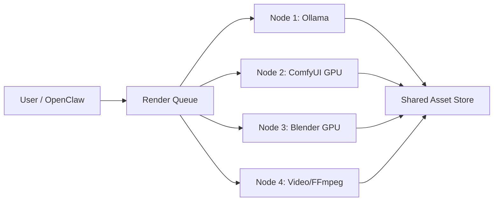

# AI 3D Kubernetes Scaling

Dieses Dokument beschreibt die spaetere Skalierung des AI-3D-Studios auf GPU-Nodes. Lokal unter WSL2/Ubuntu bleibt Docker optional; Kubernetes ist ein Ausbaupfad fuer Render-Farmen und Batch-Jobs.

## Zielarchitektur

## Komponenten

- GPU Worker Nodes fuer ComfyUI und Hunyuan3D.
- Blender Worker fuer Headless Rendering und Export.
- Queue-System fuer Jobs, Prioritaeten und Wiederaufnahme.
- Shared Storage via MinIO, NFS oder Longhorn.
- Monitoring mit Prometheus/Grafana/Netdata.
- Optional Autoscaling ueber Node Labels und GPU-Auslastung.

## Node Rollen

- `ai-llm`: Ollama, OpenClaw Gateway, Promptplanung.
- `ai-comfyui`: ComfyUI, Hunyuan3D Nodes, TripoSR Nodes.
- `ai-blender`: Blender Headless, Cycles GPU, Exportjobs.
- `ai-render`: FFmpeg, Preview Videos, Social Exports.

## GPU Hinweise

- NVIDIA RTX: CUDA/OptiX bevorzugt, RTX 5080 mit aktuellem Treiber und passender CUDA/PyTorch-Kombination planen.
- AMD: ROCm-Unterstuetzung fuer 3D/ComfyUI ist projektabhaengig; Hunyuan3D-Nodes koennen CUDA-Annahmen enthalten.
- Multi-GPU: lieber Job-Level-Parallelisierung als ein einzelnes riesiges Modell ueber mehrere GPUs erzwingen.

