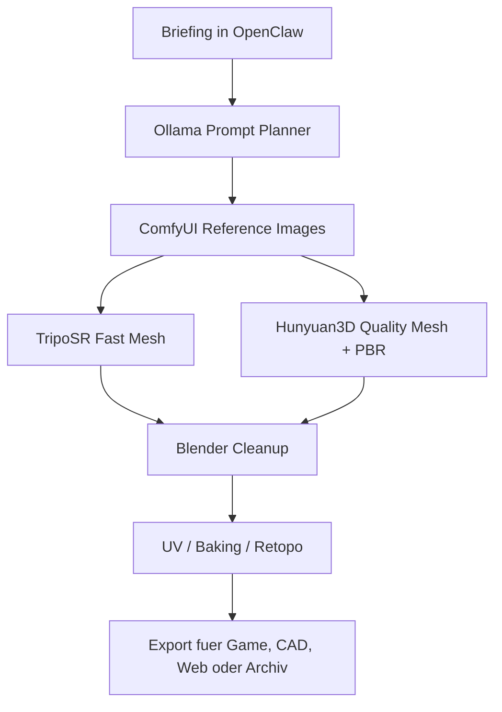

# Open Source AI 3D Studio

Das AI-3D-Studio ist ein optionaler Ausbau fuer lokale 3D-Generierung, Game-Asset-Produktion, CAD-nahe Prototypen und Render-Automation. Ziel ist kein Cloud-Zwang, sondern eine offene Pipeline aus Ollama, OpenClaw, ComfyUI, Blender, Hunyuan3D und TripoSR.

## Quellen und Einordnung

- Hunyuan3D 2.1: `https://github.com/tencent-hunyuan/hunyuan3d-2.1`
- TripoSR: `https://github.com/VAST-AI-Research/TripoSR`
- ComfyUI Hunyuan3D Nodes: `https://github.com/visualbruno/ComfyUI-Hunyuan3d-2-1`
- ComfyUI Flowty TripoSR Nodes: `https://github.com/flowtyone/ComfyUI-Flowty-TripoSR`
- ComfyUI Tripo Nodes: `https://github.com/VAST-AI-Research/ComfyUI-Tripo`

Hunyuan3D 2.1 ist eher die hochwertige PBR-Asset-Pipeline. TripoSR ist die schnelle lokale Single-Image-zu-Mesh-Rekonstruktion. Zusammen sind sie sinnvoll: TripoSR fuer schnelle Entwuerfe, Hunyuan3D fuer finale oder hochwertigere Assets.

## Projektstruktur

Der Installer legt unter `~/Ultimate_KI_Setup` diese Struktur an:

```text
Ultimate_KI_Setup/
  3d/
  blender/
  comfyui/
  assets/
  renders/
  stl/
  workflows/
  textures/
  animations/
  exports/
  docs/
  models/
  logs/
```

## Pipeline



## Sicherheit und Speicher

- Keine API-Keys ins Repo schreiben.
- Keine grossen Modelle automatisch herunterladen.
- Vor Modell-Downloads freien Speicher pruefen.
- Generated Assets koennen urheberrechtliche oder personenbezogene Bezuege haben.
- Cloud-APIs nur optional und mit Kostenlimit verwenden.

