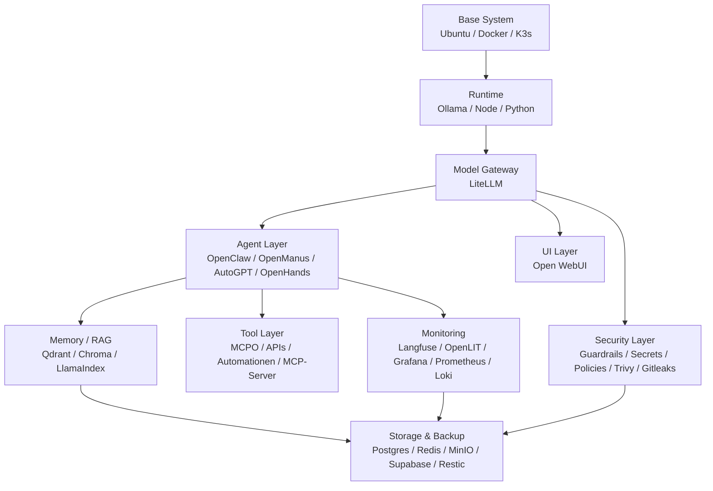

# LLMOps Plattform-Architektur

## Zielbild

Diese Architektur transformiert das Setup von einer Sammlung einzelner Tools zu einer modularen, reproduzierbaren und sicheren LLMOps-Plattform für lokale und hybride KI-Agenten.

## Layer

### 1. Base System

- Ubuntu 24.04 LTS oder ähnliche Linux-Basis
- Docker oder Podman für isolierte Dienste
- K3s für Cluster- oder VPS-Szenarien

Abhängigkeiten:
- `docker`
- `k3s`
- `kubectl`

### 2. Runtime

- `Ollama` für lokale Modelle
- `Node.js` und `pnpm` für JavaScript-basierte Tools
- `Python` für Agenten, RAG und LLMOps-Bausteine

Abhängigkeiten:
- `ollama`
- `nodejs>=22`
- `python3`

### 3. Model Gateway

- `LiteLLM` als zentrale API-Schicht
- Routing zwischen `Ollama`, `Gemini`, `OpenAI`
- Logging, Fallbacks, einheitliche OpenAI-kompatible Endpunkte

Abhängigkeiten:
- `LiteLLM`
- API-Keys für Cloud-Fallbacks

### 4. Agent Layer

- `OpenClaw`
- `OpenManus`
- `AutoGPT`
- `OpenHands`
- optional `Aider`, `OpenCode`, `Continue.dev`

Abhängigkeiten:
- lokales oder remote Modellgateway
- Toolserver
- Memory/RAG

### 5. Memory / RAG

- `Qdrant` als Haupt-Vektordatenbank
- `ChromaDB` für leichte lokale Retrieval-Fälle
- `LlamaIndex` und `LangChain` für Import, Chunking und Retrieval

Abhängigkeiten:
- Storage
- Modell-Embeddings

### 6. Tool Layer

- `MCPO` als Brücke für MCP-Server
- `n8n`, `Activepieces`, `Huginn`
- APIs und Connectoren

Abhängigkeiten:
- Gateway oder Agenten
- Secrets

### 7. UI Layer

- `Open WebUI` als Standard-Frontend
- Multi-Model-Zugriff über LiteLLM
- RAG- und Agenten-nahe Bedienung

Abhängigkeiten:
- LiteLLM
- Ollama oder Cloud-Provider

### 8. Monitoring

- `Langfuse` für LLM-Traces
- `OpenLIT` für Instrumentierung
- `Prometheus`, `Grafana`, `Loki`
- optional `Uptime Kuma`, `Netdata`

Abhängigkeiten:
- App- und Modellzugriffe
- Log- und Metric-Endpunkte

### 9. Security Layer

- `.env`- und Workspace-Trennung
- `Guardrails AI`
- `Promptfoo`
- `Trivy`
- `Gitleaks`
- Firewall und optional Cloudflare Tunnel

Abhängigkeiten:
- Secrets
- Policies
- Netzwerkgrenzen

### 10. Storage & Backup

- `Postgres`
- `Redis`
- `MinIO`
- `Supabase`
- optional `restic` oder `borg`

Abhängigkeiten:
- Volumes
- Snapshot-/Backup-Ziel

## Betriebsabhängigkeiten

- `Open WebUI` hängt an `LiteLLM`
- `LiteLLM` hängt an `Ollama` und optional Cloud-Keys
- `OpenClaw` und andere Agenten hängen an Gateway, Tool Layer und Memory
- `Langfuse` und `OpenLIT` hängen an der Instrumentierung der Apps
- `Qdrant`, `Postgres`, `Redis` und `MinIO` sollten als zustandsbehaftete Kernservices behandelt werden

## Produktionshinweise

- sensible Dateien gehören in `~/.openclaw_ultimate_user_data`
- öffentlich erreichbare Endpunkte nur über Gateway, Auth und Reverse Proxy
- `Open WebUI` und `LiteLLM` nicht ungeschützt auf `0.0.0.0` freigeben
- Monitoring und Security sollten nicht optionaler Nachgedanke, sondern Teil des Standard-Stacks sein
