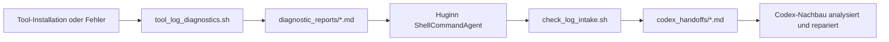

# Huginn Log-Diagnose-Worktree

Dieser Worktree ist eine kleine Brücke zwischen Setup-Logs, Huginn und einem Codex-Nachbau.

Er prüft, ob neue Diagnoseberichte eingegangen sind, erzeugt daraus eine bereinigte Markdown-Übergabe und legt diese lokal so ab, dass Codex direkt weiterarbeiten kann.

## Zielbild



## Komponenten

- `scripts/tool_log_diagnostics.sh`
  Erstellt gefilterte Diagnoseberichte aus Installationslogs.
- `scripts/huginn_log_worktree/check_log_intake.sh`
  Erkennt neue Diagnoseberichte und erzeugt Codex-Handoff-Dateien.
- `configs/huginn/log-diagnostic-watch/`
  Enthält Vorlage, Beispiel-Event und Handoff-Beispiel für Huginn.
- `~/.openclaw_ultimate_user_data/diagnostic_reports/`
  Lokaler Eingang für Diagnoseberichte.
- `~/.openclaw_ultimate_user_data/codex_handoffs/`
  Lokaler Ausgang für Codex-fertige Übergabedateien.

## Installation

Die Dateien liegen im Repository und werden beim Kopieren/Update des Setups nach `~/openclaw_ultimate_setup` nutzbar.

```bash
cd ~/openclaw_ultimate_setup
chmod +x scripts/huginn_log_worktree/check_log_intake.sh
```

Optional kann Huginn den Check regelmäßig ausführen. Dafür muss der ShellCommandAgent bewusst aktiviert werden:

```bash
sudo sed -i 's/^ENABLE_INSECURE_AGENTS=.*/ENABLE_INSECURE_AGENTS=true/' /opt/huginn/.env
grep -q '^ENABLE_INSECURE_AGENTS=' /opt/huginn/.env || echo 'ENABLE_INSECURE_AGENTS=true' | sudo tee -a /opt/huginn/.env
sudo systemctl restart huginn-web.service huginn-worker.service
```

Sicherheitswarnung: `ENABLE_INSECURE_AGENTS=true` erlaubt Huginn das Ausführen lokaler Shell-Kommandos. Das ist für diesen lokalen Automationsfall nützlich, gehört aber nur auf eine private, nicht öffentlich administrierbare Huginn-Instanz.

## Schnelltest ohne Huginn

```bash
cd ~/openclaw_ultimate_setup
bash scripts/tool_log_diagnostics.sh --tool Huginn --no-email
bash scripts/huginn_log_worktree/check_log_intake.sh
ls -1t ~/.openclaw_ultimate_user_data/codex_handoffs/*.md | head
```

Erwartung:

- Beim ersten Lauf mit neuem Bericht erscheint `status":"new_reports"`.
- Beim zweiten Lauf ohne neuen Bericht erscheint `status":"no_new_reports"`.
- Die erzeugte Datei liegt in `~/.openclaw_ultimate_user_data/codex_handoffs/`.

## Huginn-Agent anlegen

1. Huginn öffnen: `http://127.0.0.1:3002`
2. `Agents` öffnen.
3. `New Agent` wählen.
4. Typ `Shell Command Agent` auswählen.
5. Name: `OpenClaw Diagnoseberichte pruefen`
6. Schedule: `every_5m`
7. Optionen eintragen:

```json
{
  "path": "/home/ubuntu/openclaw_ultimate_setup",
  "command": "bash scripts/huginn_log_worktree/check_log_intake.sh",
  "unbundle": true,
  "suppress_on_failure": false,
  "suppress_on_empty_output": true,
  "expected_update_period_in_days": 1
}
```

Danach kann der Agent per `Dry Run` getestet werden.

## Codex-Übergabe

Eine erzeugte Handoff-Datei enthält:

- Quelle des Diagnoseberichts
- gefilterten Fehlerauszug
- sichere Standardaufgabe für Codex
- lokale Pfade
- nächste Prüfkommandos
- Hinweis auf mögliche private Daten

Beispiel:

```bash
latest="$(ls -1t ~/.openclaw_ultimate_user_data/codex_handoffs/*.md | head -n 1)"
sed -n '1,220p' "$latest"
```

Diese Datei kann direkt in deinen Codex-Nachbau gegeben werden, damit er mit demselben Arbeitskontext weiter analysieren kann.

## E-Mail-Variante

Für ausgehende Diagnosemails nutzt das Setup `mailutils` und `msmtp`.

Wichtig:

- SMTP-Zugangsdaten werden nicht im Repository gespeichert.
- Die Konfiguration liegt unter `~/.openclaw_ultimate_user_data/mail/`.
- Viele Anbieter wie WEB.DE, GMX oder Gmail müssen Drittanbieter-Mailprogramme zuerst erlauben oder ein App-Passwort nutzen.
- Der Absender muss zum SMTP-Konto passen, sonst lehnen Anbieter häufig mit `Sender address is not allowed` ab.

Für eingehende E-Mails kann Huginn zusätzlich ein Postfach per IMAP überwachen. Das ist als zweiter Schritt sinnvoll, wenn Diagnoseberichte nicht nur lokal, sondern über Mail ankommen sollen. Die IMAP-Zugangsdaten gehören dann in Huginn-Credentials oder lokale Benutzerkonfiguration, niemals ins Git-Repository.

## Datenschutz und Betrieb

- Diagnoseberichte werden basis-redigiert, aber nicht perfekt anonymisiert.
- Vor Weitergabe an externe Systeme immer manuell prüfen.
- Alte Logs können über die Installationsüberwachung im Setup bereinigt werden.
- Der Worktree löscht keine Originalberichte automatisch.
- Die State-Datei liegt unter `~/.openclaw_ultimate_user_data/huginn_log_worktree/processed_reports.tsv`.

## Nützliche Kommandos

```bash
systemctl is-active huginn-web.service huginn-worker.service
curl -I http://127.0.0.1:3002
bash scripts/huginn_log_worktree/check_log_intake.sh
tail -n 80 ~/.openclaw_ultimate_user_data/mail/msmtp.log
```

## Fehlerbilder

- `ShellCommandAgent disabled`
  `ENABLE_INSECURE_AGENTS=true` fehlt in `/opt/huginn/.env` oder Huginn wurde danach nicht neu gestartet.
- `no_new_reports`
  Es gibt keine neuen `.md`-Dateien oder sie wurden bereits verarbeitet.
- `Permission denied`
  Skript ausführbar machen oder Pfade unter `~/.openclaw_ultimate_user_data/` prüfen.
- `mail ... non-zero status`
  SMTP-Absender, Provider-Freigabe, App-Passwort oder `msmtp`-Konfiguration prüfen.
