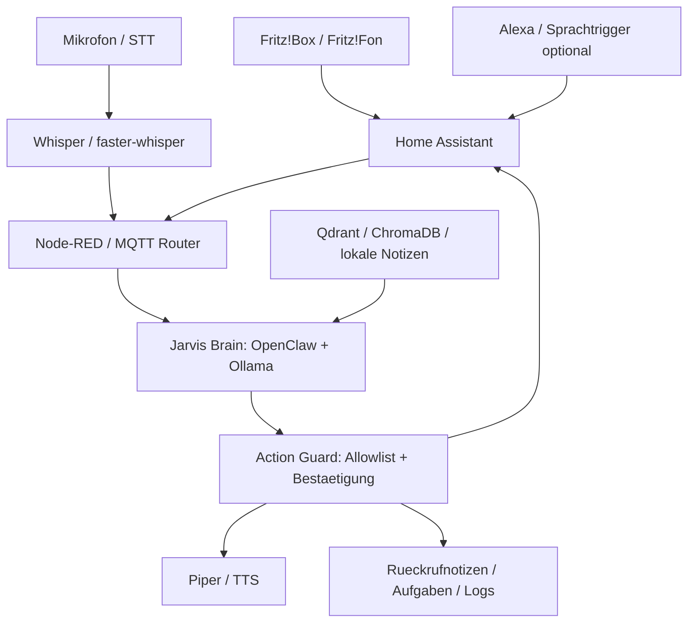

# Jarvis FritzBox Alexa Home Assistant

## Kurzbeschreibung

Dieses Profil beschreibt einen lokalen Jarvis-aehnlichen Assistenten fuer Telefonie, Smart Home und Sprachsteuerung. Es verbindet Fritz!Box/Fritz!Fon, Home Assistant, Alexa-nahe Sprachtrigger, lokale STT/TTS-Bausteine, Ollama und OpenClaw zu einem kontrollierten Heimassistenten.

Das Profil ersetzt nicht `Voice_Assistant` oder `Smart_Home_AI_Assistant`, sondern fuehrt beide Welten zusammen:

- Telefonie-Events aus Fritz!Box oder Fritz!Fon
- Home-Assistant-Automationen
- lokale Sprachverarbeitung
- LLM-Reasoning mit Ollama
- Agentensteuerung mit OpenClaw
- Memory/Brain-Konzept fuer Kontext, Regeln und persoenliche Routinen

## Was bedeutet "Jarvis Brain"?

Mit `Brain` ist in diesem Setup kein einzelnes Tool gemeint. Es ist die zentrale Logikschicht, die mehrere Komponenten zusammenfuehrt:

- `Ollama` liefert das lokale Sprachmodell fuer Verstehen, Antworten und Plaene.
- `OpenClaw` uebernimmt Agentenlogik, Tool-Nutzung, Aufgabenketten und spaetere Memory-Workflows.
- `Home Assistant` ist der sichere Aktions- und Ereignis-Hub fuer Haus, Telefonie, Sensoren und Geraete.
- `Node-RED` kann Ereignisse routen, filtern und einfache Regeln ohne Code verbinden.
- `Mosquitto/MQTT` ist die lokale Nachrichtenleitung zwischen Diensten.
- `Qdrant` oder `ChromaDB` koennen spaeter Erinnerungen, Telefonnotizen, Routinen und Hauswissen speichern.
- `Piper` und `Whisper/faster-whisper` bilden die lokale Sprach-Ausgabe und Sprach-Erkennung.

Praktisch ist das Brain also:

```text
Ereignisse + Sprache + Telefonie + Smart Home
  -> Kontext und Regeln
  -> LLM/Agentenentscheidung
  -> Sicherheitsfreigabe
  -> Aktion, Antwort oder Notiz
```

## Typische Einsatzgebiete

- Eingehende Anrufe der Fritz!Box lokal erkennen und im Dashboard anzeigen.
- Verpasste Anrufe als Aufgabe, Erinnerung oder Home-Assistant-Benachrichtigung speichern.
- Per Sprache fragen: "Wer hat zuletzt angerufen?"
- Rueckrufnotizen erstellen, ohne private Daten ins Git-Repository zu schreiben.
- Alexa als Sprach-Trigger oder Ausgabeweg nutzen, soweit die Home-Assistant-Integration dies erlaubt.
- Home-Assistant-Szenen per Jarvis-Brain planen und mit Freigabe ausfuehren.
- Lokale TTS-Antworten ueber Piper erzeugen.
- Sprachbefehle per Whisper/faster-whisper lokal transkribieren.
- Node-RED-Flows fuer Telefonie, MQTT, Benachrichtigung und Dashboard nutzen.
- Spaeter Asterisk/SIP als echte Telefonie-Schicht anbinden.

## Grenzen bei Alexa und Fritz!Box

Alexa ist in diesem Profil nicht die Telefonanlage. Die Telefonanlage bleibt die Fritz!Box bzw. optional spaeter Asterisk/SIP.

Sinnvolle Rollen:

- Fritz!Box: Telefoniequelle, Anrufmonitor, Telefonbuch, Fritz!Fon-Umgebung.
- Home Assistant: Ereignis-Hub und Automationslogik.
- Alexa: optionaler Sprachtrigger oder Ausgabegeraet ueber Home Assistant bzw. Alexa-Integrationen.
- Jarvis Brain: lokale Entscheidungsschicht mit Ollama/OpenClaw/Memory.

Wichtig: Alexa ist ein Cloud-naher Dienst. Fuer private oder sensible Telefonie sollte die lokale Route ueber Fritz!Box, Home Assistant, MQTT, Whisper und Piper bevorzugt werden.

## Empfohlene Komponenten

### Core

- `Home Assistant`
- `Mosquitto`
- `Node-RED`
- `Ollama`
- `OpenClaw`
- `Piper`
- `faster-whisper` oder `Whisper.cpp`

### Optional

- `Qdrant` oder `ChromaDB` fuer Memory/RAG
- `Open WebUI` fuer manuelle Tests und Promptpflege
- `Tailscale` fuer privaten Remote-Zugriff
- `Authentik` oder `Authelia` fuer Web-Auth vor Dashboards
- `Grafana/Prometheus` fuer Betriebsuebersicht
- `openWakeWord`, `Rhasspy` und `Wyoming`, falls die Voice-Pipeline lokal ausgebaut wird

### Advanced / geplant

- Fritz!Box Call Monitor
- Fritz!Box TR-064
- Alexa Media Player fuer Home Assistant
- Asterisk/SIP als lokale Telefonzentrale
- Fritz!Fon-nahe Workflows ueber Fritz!Box-Ereignisse
- lokale Call-Transkription nur nach klarer Zustimmung

## Architekturvorschlag



## Betriebsmodi

### Local-only

- keine externen Cloud-APIs
- Home Assistant nur im LAN oder per Tailscale
- STT/TTS lokal
- Telefoniedaten nur lokal speichern

### Alexa-Bridge

- Alexa dient als Sprachtrigger oder Ausgabekanal
- Home Assistant bleibt die zentrale Steuerung
- private Telefonieinhalte nicht ungefiltert an Cloud-Dienste senden

### Telefonie-Lab

- Fritz!Box Call Monitor oder TR-064 testen
- Anrufereignisse in Node-RED protokollieren
- Rueckrufaufgaben erzeugen
- keine automatische Aufzeichnung

### Advanced SIP

- Asterisk/SIP optional als eigene Telefonzentrale
- nur fuer fortgeschrittene Nutzer
- eigene Sicherheits- und Datenschutzpruefung erforderlich

## Sicherheit und Datenschutz

- Keine heimliche Anrufaufzeichnung.
- Keine versteckte Raumueberwachung.
- Keine automatische Weitergabe von Anruferdaten an Cloud-Dienste.
- Keine Notruf- oder sicherheitskritische Aktion ohne manuelle Bestaetigung.
- Keine Tueroeffner-, Alarmanlagen- oder Schloss-Automation ohne harte Allowlist und Bestaetigung.
- Telefonbuch, Anruflisten und Transkripte sind personenbezogene Daten.
- Standard: lokale Verarbeitung, kurze Aufbewahrung, klare Logs.
- Secrets gehoeren nach `~/.openclaw_ultimate_user_data`, nie ins Repository.

## Beispiel `.env.template`

```env
PROFILE_NAME=Jarvis_FritzBox_Alexa_Home_Assistant
JARVIS_ENABLED=false
JARVIS_MODE=local_only
JARVIS_BRAIN_PROVIDER=ollama
DEFAULT_LLM_MODEL=llama3.2

HOME_ASSISTANT_URL=http://127.0.0.1:8123
MQTT_HOST=127.0.0.1
MQTT_PORT=1883

FRITZBOX_HOST=fritz.box
ENABLE_FRITZBOX_CALL_MONITOR=false
ENABLE_FRITZBOX_TR064=false
ENABLE_ALEXA_BRIDGE=false
ENABLE_SIP_ASTERISK=false

ENABLE_STT=true
ENABLE_TTS=true
DEFAULT_STT_ENGINE=faster_whisper
DEFAULT_TTS_ENGINE=piper

ENABLE_CALL_RECORDING=false
ENABLE_CALL_TRANSCRIPTION=false
REQUIRE_CONFIRMATION_FOR_ACTIONS=true
JARVIS_ACTION_ALLOWLIST=notify,create_note,create_task,read_status

MEMORY_BACKEND=local
DATA_RETENTION_DAYS=7
LOG_LEVEL=info
```

## Empfohlene Ordnerstruktur

```text
profiles/jarvis-fritzbox-alexa-homeassistant/
  configs/
  prompts/
  automations/
  node-red/
  home-assistant/
  mqtt/
  voice/
  telephony/
  logs/
  docs/
```

## Beispiel-Prompts

### Telefonie-Event zusammenfassen

```text
Du bist Jarvis im lokalen Heimnetz. Fasse dieses Fritz!Box-Anrufereignis kurz zusammen.
Erzeuge keine Spekulationen. Wenn Telefonnummer oder Name fehlen, markiere sie als unbekannt.
Ausgabe: Zeitpunkt, Richtung, Kontakt, Aktionsempfehlung.
```

### Rueckrufnotiz erstellen

```text
Erstelle aus diesem Anrufereignis eine kurze Rueckrufnotiz.
Nutze maximal drei Saetze.
Fuege keine privaten Details hinzu, die nicht im Ereignis stehen.
```

### Home-Assistant-Aktion absichern

```text
Pruefe, ob die gewuenschte Smart-Home-Aktion in der Allowlist steht.
Wenn sie Licht, Medien oder Benachrichtigung betrifft, formuliere eine sichere Aktion.
Wenn sie Schloss, Alarmanlage, Tueroeffner, Heizung oder Sicherheit betrifft, verlange manuelle Bestaetigung.
```

### Alexa-Bridge privat halten

```text
Formuliere eine kurze Alexa-kompatible Antwort, ohne Telefonnummern, Adressen oder private Anrufdetails auszugeben.
Falls private Daten benoetigt werden, sage nur: "Ich habe eine private Notiz im lokalen Dashboard abgelegt."
```

## Installations-Checkliste

- Home Assistant lokal erreichbar machen.
- Fritz!Box-Integration in Home Assistant pruefen.
- MQTT/Mosquitto nur lokal und mit Auth betreiben.
- Node-RED-Flows fuer Anrufereignisse und Benachrichtigungen testen.
- Ollama-Modell lokal laden.
- OpenClaw als Agenten-/Tool-Schicht vorbereiten.
- STT/TTS getrennt testen.
- Alexa-Bridge nur bewusst aktivieren.
- Datenschutzmodus und Aufbewahrungsdauer setzen.
- Tailscale statt offener Ports fuer Remote-Admin nutzen.

## Ollama/OpenClaw-Fit

Ollama ist fuer kurze lokale Entscheidungen, Rueckrufnotizen und natuerliche Antworten geeignet. OpenClaw eignet sich als Orchestrator, sobald mehrere Schritte noetig sind: Ereignis lesen, Memory abfragen, Aktion pruefen, Home Assistant ausloesen, Notiz speichern.

## Sinnvolle lokale Modelle

- `llama3.2:3b` fuer leichte lokale Antworten
- `qwen2.5:7b` fuer bessere strukturierte Entscheidungen
- `mistral:7b` fuer robuste Textaufgaben
- ein kleines Embedding-Modell fuer Memory/RAG, falls Qdrant oder ChromaDB genutzt wird

## Offene TODOs

- Konkreten Fritz!Box-Call-Monitor-Flow fuer Node-RED ergaenzen.
- Home-Assistant-Beispielautomation fuer verpasste Anrufe dokumentieren.
- Optionales Asterisk/SIP-Profil spaeter getrennt bewerten.
- Alexa Media Player / Skill-Pfad nur dokumentieren, wenn rechtlich und technisch sauber.
- Jarvis-Brain-Prompt mit OpenClaw-Memory verbinden.
