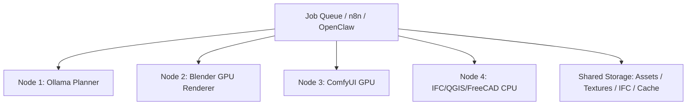

# Architektur 3D BIM

Das Profil `Architektur_3D_BIM` beschreibt ein lokales, KI-gestuetztes Architektur-, CAD-, BIM- und 3D-Rendering-Setup fuer Ubuntu/WSL2, Windows 11 und optional verteilte Kubernetes-/Renderfarm-Workflows. Es ist lokal-first ausgelegt und verbindet Ollama, OpenClaw, Codex, ComfyUI, Blender, FreeCAD, IFC/BIM-Tools, Photogrammetrie, Smart-Home-Planung und Render-Automation.

## Zielbild

```mermaid
flowchart LR
  A["Architektur-Briefing / Grundriss / Scan"] --> B["OpenClaw Architektur-Agent"]
  B --> C["Ollama / Codex Planner"]
  C --> D["CAD / BIM Modell"]
  D --> E["IFC Analyse / Materialliste"]
  E --> F["Blender / Bonsai / FreeCAD"]
  F --> G["ComfyUI Rendering / Flux / SDXL"]
  G --> H["Renderfarm / PDF / VR / AR / STL"]
  H --> I["n8n Backup / Cloudflare / Projektarchiv"]
```



## Unterstuetzte Bereiche

- Architekturplanung, Innenarchitektur und Gebaeudevisualisierung.
- BIM/IFC, CAD-Code-Generierung und OpenBIM-Workflows.
- Smart-Home-Planung mit Home Assistant, MQTT, Zigbee, Matter/Thread-Konzepten.
- Photogrammetrie, Scan-to-BIM, Mesh Cleanup und 3D-Druck.
- VR/AR Rundgaenge, Raytracing, AI Renderings und generative Architektur.
- Energieanalyse, Materialplanung, Stadtplanung und QGIS-Geodaten.
- Text-to-3D, Bild-zu-3D und Konzeptskizzen ueber ComfyUI/Stable Diffusion/Flux.

## Open-Source Toolchain

| Bereich | Tools |
| --- | --- |
| CAD / BIM | FreeCAD, Bonsai, IfcOpenShell, LibreCAD optional |
| 3D / Rendering | Blender, Cycles, Eevee, Meshroom, COLMAP |
| OpenBIM / Collaboration | IFC, Speckle, IfcOpenShell, Bonsai |
| Grundriss / Innenraum | SweetHome3D, Blender, FreeCAD |
| Energie / Klima | OpenStudio, EnergyPlus optional |
| GIS / Stadtplanung | QGIS |
| Parametrik / 3D Druck | OpenSCAD, FreeCAD, STL/OBJ/GLB |
| AI Bildsysteme | ComfyUI, Stable Diffusion, Flux, SDXL, ControlNet |
| Automation | OpenClaw, Codex, n8n, GitHub, Cloudflare Tunnel |

Hinweis: Bonsai ist die moderne Blender-basierte OpenBIM-Oberflaeche aus dem IfcOpenShell-Umfeld und war frueher als BlenderBIM Add-on bekannt.

## Ollama Modelle

| Aufgabe | Modelle | Groesse |
| --- | --- | --- |
| Architektur-Briefing und Doku | Llama, Mistral, Gemma | 7B-12B als lokale Basis |
| CAD/Python/IFC-Code | DeepSeek-Coder, Qwen Coder, CodeLlama | 7B-14B fuer WSL2, groesser mit 16-24 GB VRAM |
| BIM-/IFC-Analyse | Qwen, Llama, Mistral | 7B-32B je nach Projektgroesse |
| Rendering-Prompts | Qwen, Llama, Gemma | 7B-14B |
| Technische Dokumentation | Mistral, Llama, Phi | 3B-12B |
| Schnelle Agenten | Phi, Gemma | 2B-9B |

Empfehlung: Fuer MiniPC/CPU `Phi`, `Gemma` oder kleine `Qwen`-Modelle. Fuer RTX-Workstation `Qwen Coder 14B`, `DeepSeek-Coder` und groessere `Llama/Mistral` Varianten. Sehr grosse Modelle gehoeren eher auf GPU-Node oder VPS/GPU-Host, nicht in ein knappes WSL2-Setup.

## OpenClaw Agenten

| Agent | Aufgabe |
| --- | --- |
| `architektur-assistent` | Projektbriefing, Raumprogramm, Varianten, Plausibilitaet |
| `bim-analyst` | IFC-Struktur, Bauteile, Mengen, Klassifikation, Konflikte |
| `cad-code-generator` | FreeCAD/OpenSCAD/Python-Skripte, parametrische Bauteile |
| `innenraum-designer` | Moeblierung, Materialien, Lichtstimmung, Render-Prompts |
| `materialplaner` | Materiallisten, Kosten, Nachhaltigkeit, Varianten |
| `smarthome-architekt` | Home Assistant, Sensorik, Zonen, Netzwerk, Automationen |
| `stadtplanungs-ki` | QGIS, Lage, Nachbarschaft, Flaechen, Mobilitaet |
| `renderfarm-manager` | Blender Queue, GPU-Zuweisung, Cache, Output-Archiv |
| `ifc-parser` | IfcOpenShell Checks, Datenextraktion, Report |
| `stl-3d-druck-assistent` | Druckbarkeit, Scale, Wandstaerke, STL-Reparatur |

## n8n Workflows

- Automatische Blender-/ComfyUI-Renderjobs nach Projektstand.
- IFC Analyse mit Markdown/PDF-Report.
- Materiallisten und Mengen aus IFC/CSV exportieren.
- Bild-zu-3D und Text-to-3D Pipeline fuer Konzeptmodelle.
- Grundrissanalyse und Raumprogramm-Check.
- Automatische Backup- und Projektverwaltung.
- Cloudflare Tunnel fuer Remote-WebUI nur mit Auth/Zero-Trust.
- Home Assistant Discovery fuer geplante Sensorik und Smart-Home-Zonen.

## Kubernetes / Renderfarm



- GPU Rendering Nodes fuer Blender/Cycles und ComfyUI.
- Verteiltes KI-Rendering mit Job-Level-Parallelisierung.
- Ollama Cluster optional fuer mehrere Modellrollen.
- Gemeinsame Texture Libraries auf MinIO/NFS/Longhorn.
- Rendercache getrennt von Projektdaten halten, damit Cleanup gefahrlos bleibt.
- Multi-GPU: lieber parallele Renderjobs als ein einziges Modell ueber alle GPUs erzwingen.

## ComfyUI / AI Bildsysteme

- Stable Diffusion, SDXL und Flux fuer Konzeptbilder und Stilvarianten.
- ControlNet fuer Depth, Lineart, Canny, Scribble und Grundriss-Fuehrung.
- Depth Mapping fuer Innenraeume, Fassaden und Foto-zu-3D-Hilfen.
- Architektur-LoRAs, Innenraum-LoRAs und Material-LoRAs nur mit sauberer Lizenz pruefen.
- Render-to-render: Blender Preview -> ComfyUI Stil/Material -> finaler Architektur-Render.

## Projektordner

```text
Ultimate_KI_Setup/architecture/
  projects/
  bim/
  ifc/
  cad/
  blender/
  freecad/
  renders/
  textures/
  photogrammetry/
  gis/
  energy/
  stl/
  vr_ar/
  backups/
  cache/
  reports/
  logs/
```

## Best Practices

- OpenBIM/IFC als Austauschformat bevorzugen.
- Projektentscheidungen und Annahmen in Markdown dokumentieren.
- Rendercache, Texturen und Modelle von Quellprojekten trennen.
- IFC-Dateien versionieren, grosse Renderoutputs optional aus Git heraushalten.
- Lizenz jedes Modells, Texturpakets, LoRA und Datensatzes pruefen.
- Cloudflare Tunnel nur fuer WebUIs mit Auth, nicht fuer rohe Render-/Dateiserver.
- Smart-Home-Planung niemals ungeprueft an echte Stromkreise koppeln.

## Sicherheit und Grenzen

- KI-Ausgaben ersetzen keine Architekten-, Statik-, Brandschutz- oder Bauordnungspruefung.
- Energieanalyse und Simulation sind nur so gut wie Eingabedaten und Annahmen.
- Gebaeudescans koennen personenbezogene oder sicherheitsrelevante Informationen enthalten.
- Remote-WebUI-Zugriff nur ueber Auth, Tunnel und Rollenrechte.
- Backups vor automatischen Konvertierungen und Batch-Renderjobs anlegen.

## Erster Start

```bash
bash scripts/tools/architecture_bim_install.sh
cp config/architecture_bim.env.example .env.architecture_bim
```

Danach ein erstes Projekt unter `~/Ultimate_KI_Setup/architecture/projects` anlegen und mit FreeCAD, Blender/Bonsai oder IfcOpenShell testen.

