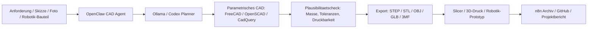

# CAD 3D Konstruktion

Das Profil `CAD_3D_Konstruktion` erweitert das Ultimate KI Setup um lokale CAD-, 3D-Konstruktions-, Text-to-CAD-, OpenSCAD-, FreeCAD-, 3D-Druck- und Robotik-Bauteil-Workflows. Es ist lokal-first fuer Ubuntu/WSL2 ausgelegt, nutzt Ollama, OpenClaw, n8n und kann spaeter mit Cloudflare/Tailscale, Mini-PCs, GPU-Workern oder Kubernetes-Render-/Build-Nodes erweitert werden.

## Ziel

Dieses Profil soll aus technischen Anforderungen wiederholbare CAD-Artefakte erzeugen:

- Text-to-CAD: Idee oder Spezifikation zu parametrischem CAD-Skript.
- FreeCAD Python: Bauteile, Baugruppen, Skizzen, Constraints und STEP/STL-Export.
- OpenSCAD: robuste, textbasierte Konstruktion fuer 3D-Druck und Varianten.
- CadQuery/build123d: optionale Python-Parametrik fuer reproduzierbare Modelle.
- 3D-Druck: STL/3MF/OBJ pruefen, reparieren, orientieren und dokumentieren.
- Robotik-Bauteile: Halterungen, Sensor-Mounts, Greiferfinger, Adapterplatten, Kabelhalter.
- Mechanische Plausibilitaet: Wandstaerke, Toleranzen, Schraubdome, Einpressmuttern, Montagefreiheit.
- Projekt-Dokumentation: BOM, Zeichnungsnotizen, Fertigungshinweise, Versionsprotokoll.

KI erzeugt Vorschlaege und Skripte, ersetzt aber keine echte Konstrukteurspruefung. Tragende, sicherheitskritische, elektrische, druckbeaufschlagte oder bewegte Bauteile brauchen Simulation, Materialdaten, Normen, Tests und Fachfreigabe.

## Architektur



## Open-Source Toolchain

| Bereich | Tools | Aufgabe |
| --- | --- | --- |
| CAD Kern | FreeCAD | Parametrische Modelle, STEP/STL, Python-Automation |
| Script-CAD | OpenSCAD | Textbasierte, reproduzierbare Konstruktionen |
| Python-CAD | CadQuery, build123d optional | Text-to-CAD, Feature-basierte Bauteile |
| Mesh / Repair | MeshLab, Blender, trimesh | STL/OBJ pruefen, reparieren, konvertieren |
| 3D-Druck | PrusaSlicer oder Cura optional | Slicing, Druckprofile, G-Code-Pruefung |
| Robotik | ROS 2/Gazebo/MoveIt optional | Bauteile in Simulation und URDF-Kontext pruefen |
| Automation | OpenClaw, Codex, n8n | Agenten, Reviews, Exportketten, Archivierung |
| Zugriff | Tailscale / Cloudflare Access optional | Remote-WebUI und Projektzugriff absichern |
| Skalierung | Kubernetes optional | Batch-Exports, Renderjobs, STL-Pruefqueue |

## Workflows

### Text zu OpenSCAD

1. OpenClaw sammelt Masse, Material, Toleranzen und Montageanforderungen.
2. Ollama/Codex erzeugt ein parametrisierbares `.scad`-Skript.
3. OpenSCAD rendert STL/PNG Preview.
4. Ein Check prüft Wandstaerke, Bohrungen, Schraubdome und Mindesttoleranzen.
5. n8n archiviert Skript, STL, Preview und Prompt.

### Text zu FreeCAD

1. Agent erzeugt FreeCAD-Python mit dokumentierten Parametern.
2. FreeCAD laeuft optional headless fuer STEP/STL-Export.
3. Das Ergebnis wird in `exports/step`, `exports/stl` und `reports` abgelegt.
4. Der Mensch prueft Masse, Skizzen, Booleans, Druckbarkeit und Material.

### Robotik-Bauteil

Geeignete Beispiele:

- Kamerahalter fuer mobile Roboter.
- Sensor-Mount fuer ESP32, ToF, Ultraschall oder IMU.
- Greiferfinger mit austauschbarer Gummiauflage.
- Adapterplatte fuer Linearfuehrung oder Servo.
- Kabelkamm, Schleppkettenhalter, Schutzabdeckung.

Nicht automatisch freigeben:

- Tragende Greifer fuer schwere Lasten.
- Sicherheitsrelevante Schutzhauben.
- Druckbehaelter, Hebezeuge, Bremsen, Motorhalter unter Last.
- Teile an echten Maschinen ohne technische Abnahme.

## Agenten

| Agent | Aufgabe |
| --- | --- |
| `cad-planner` | Anforderungen, Masse, Toleranzen, Fertigungsverfahren strukturieren |
| `openscad-generator` | Parametrische OpenSCAD-Skripte erzeugen und Varianten ableiten |
| `freecad-operator` | FreeCAD-Python, STEP/STL-Export und Modellberichte vorbereiten |
| `printability-reviewer` | Wandstaerke, Ueberhaenge, Bohrungen, Toleranzen, Support-Risiken pruefen |
| `robotics-part-designer` | Halter, Adapter, Greiferfinger und URDF-nahe Bauteile planen |
| `bom-doc-agent` | BOM, Druckhinweise, Schrauben, Inserts und Montageanleitung erstellen |

## Ollama Modelle

| Aufgabe | Empfehlung |
| --- | --- |
| CAD-/Python-Code | `qwen2.5-coder`, `deepseek-coder`, `codellama` |
| Technische Spezifikation | `llama3.1`, `mistral`, `qwen2.5` |
| Kleine lokale Assistenten | `phi3`, `gemma2`, kleine Qwen-Modelle |
| Review und Doku | Qwen, Llama, Mistral je nach RAM/VRAM |

CPU-only reicht fuer Planung, OpenSCAD und kleinere FreeCAD-Skripte. GPU ist fuer klassische CAD-Erzeugung nicht zwingend, hilft aber bei ComfyUI/Rendering, Mesh-Visualisierung oder spaeteren 3D-AI-Modellen.

## Projektstruktur

```text
~/Ultimate_KI_Setup/cad_3d_konstruktion/
  requirements/
  prompts/
  openscad/
  freecad/
  cadquery/
  build123d/
  meshes/
  exports/
    stl/
    step/
    obj/
    glb/
    3mf/
  previews/
  slicer/
  robotik_bauteile/
  reports/
  archive/
  logs/
```

## Beispielprompts

```text
Erstelle ein parametrisches OpenSCAD-Modell fuer ein ESP32-Sensorgehaeuse:
80 x 45 x 25 mm, Wandstaerke 2 mm, Deckel mit vier M3-Schrauben,
USB-C Ausschnitt, Lueftungsschlitze, STL-Export, druckbar ohne Support.
```

```text
Erzeuge FreeCAD-Python fuer eine Kamerahalterung an einem mobilen Roboter:
Grundplatte 60 x 40 x 4 mm, zwei Langloecher M4, vertikale Lasche,
15 Grad Neigung, STEP und STL Export, alle Parameter am Anfang.
```

```text
Pruefe dieses STL-Konzept auf 3D-Druckbarkeit:
Wandstaerken, Bohrungen, Ueberhaenge, Supportbedarf, Toleranzen,
Einpressmuttern und moegliche Bruchstellen.
```

## n8n Automationsideen

- Neuer GitHub Issue mit CAD-Briefing erzeugt Projektordner und Prompt-Template.
- Upload eines `.scad` oder `.py` startet Preview-/Export-Job.
- STL wird gezippt und mit Markdown-Report archiviert.
- Nach erfolgreichem Export wird ein Pull Request mit CAD-Skript und Report erstellt.
- Batch-Varianten fuer Schraubabstand, Wandstaerke oder Sensorpositionen.
- Telegram/E-Mail-Meldung bei Exportfehlern oder fehlender Abnahme.

## Kubernetes und Worker

Kubernetes ist optional. Sinnvoll wird es bei Batch-Exports, vielen STL-Varianten, Render-Previews oder gemeinsamer Nutzung:

- Node 1: Ollama / OpenClaw / n8n.
- Node 2: FreeCAD/OpenSCAD Batch-Worker.
- Node 3: Blender/Preview/Render.
- Node 4: ComfyUI oder AI-3D-Worker.

CAD-Jobs sollten reproduzierbar bleiben: Eingabe, Skript, Modellversion, Toolversion und Exportparameter gehoeren in den Report.

## Sicherheit und Qualitaet

- Keine sicherheitskritischen Bauteile ohne Fachpruefung einsetzen.
- Masse, Toleranzen und Material immer manuell pruefen.
- 3D-Druckteile sind anisotrop und brechen je nach Layer-Richtung.
- Schrauben, Inserts, Lager, Motoren und Lastpfade brauchen reale Tests.
- KI-Ausgaben koennen geometrisch plausibel wirken und trotzdem unbrauchbar sein.
- Fremde CAD-Dateien koennen Lizenz- und IP-Risiken enthalten.
- Cloud-APIs nur optional nutzen; API-Keys niemals ins Repo schreiben.

## Erster Test

```bash
bash scripts/tools/cad_3d_konstruktion_install.sh
cd ~/Ultimate_KI_Setup/cad_3d_konstruktion
openscad --version
freecad --version || true
```

Wenn FreeCAD in WSL2 keine GUI oeffnet, headless ueber `FreeCADCmd` oder die Windows-FreeCAD-GUI mit gemeinsamem Projektordner nutzen.
