# Elektronik Entwickler

Das Profil `Elektronik_Entwickler` baut eine lokale KI-gestuetzte Elektronik-, PCB-, Embedded- und FPGA-Entwicklungsumgebung fuer Ubuntu/WSL2, Windows 11 und optional VPS/Kubernetes auf. Es verbindet Ollama, OpenClaw, Codex, n8n, KiCad, Simulation, Firmware-Builds, FPGA-Toolchains und Home-Assistant-nahe IoT-Hardware.

## Zielbild

```mermaid
flowchart LR
  A["Idee / Datenblatt / Sensorziel"] --> B["OpenClaw Elektronik-Agent"]
  B --> C["Ollama / Codex Planung"]
  C --> D["Schaltplan + KiCad Review"]
  D --> E["SPICE / ERC / DRC / BOM"]
  E --> F["PCB Layout + Routing Review"]
  F --> G["Firmware / FPGA Build"]
  G --> H["OpenOCD / Serial / Hardware Debug"]
  H --> I["Gerber / STL / BOM / OTA / Home Assistant"]
  I --> J["n8n Automation + Dashboard + GitHub PR"]
```



## Kernaufgaben der KI

- Schaltplaene erzeugen und gegen Designregeln pruefen.
- PCB-Layouts analysieren, Routing-Risiken erkennen und Verbesserungen vorschlagen.
- Gerber-, Drill- und BOM-Dateien auf Fertigungsrisiken pruefen.
- Datenblaetter zusammenfassen und Pinouts, Grenzwerte, Timing und Layout-Hinweise extrahieren.
- ESP32-, Arduino-, STM32-, Pico- und nRF52-Firmware erzeugen.
- Verilog/VHDL und FPGA-Projekte vorbereiten.
- IoT-Geraete, Sensorboards und Home-Assistant-Hardware entwerfen.
- EMV/EMC-, Signalintegritaets-, Power- und Thermik-Risiken frueh markieren.
- Produktionsfehler und Testpunkte vorhersagen.

## Open-Source Toolchain

| Bereich | Tools |
| --- | --- |
| PCB / EDA | KiCad, LibrePCB, Fritzing |
| Mechanik / Gehaeuse | FreeCAD |
| Circuit-as-Code | Circuit-Synth, tscircuit |
| KiCad AI | KiCad MCP Server, kicad-happy |
| Simulation | ngspice, Verilator, GTKWave |
| Embedded | PlatformIO, ESP-IDF, Arduino CLI, Zephyr RTOS, OpenOCD |
| FPGA / ASIC | Yosys, OpenROAD, OpenLane, TinyTapeout |
| Automation | OpenClaw, Codex, n8n, GitHub Actions |
| Monitoring | Prometheus/Grafana optional, Home Assistant, MQTT |

## Hardware-Ziele

- ESP32, Arduino, STM32, Raspberry Pi Pico, nRF52.
- FPGA Boards mit Verilog/VHDL/Yosys/OpenLane/OpenROAD.
- Home Assistant Sensorik ueber MQTT, ESPHome, Zigbee, LoRa, CAN Bus, RS485, Modbus.
- Netzteile, Batterieboards, Low-Power-Sensoren und Gateway-Hardware.

## AI-Agenten

| Agent | Aufgabe |
| --- | --- |
| `schematic-review-agent` | ERC, Pinout, Pullups, Versorgung, Schutzbeschaltung |
| `pcb-review-agent` | DRC, Routing, Return Paths, EMV/EMC, Testpunkte |
| `datasheet-agent` | Grenzwerte, Layout-Hinweise, Register, Timing |
| `firmware-agent` | ESP32/Arduino/STM32/Zephyr-Code, Treiber, Tests |
| `fpga-agent` | Verilog/VHDL, Yosys/Verilator/GTKWave, Timing-Hinweise |
| `power-agent` | Strombudget, Batterie-Laufzeit, Netzteil, Thermik |
| `production-agent` | BOM, JLCPCB/LCSC-nahe Verfuegbarkeit, Gerber-Check |
| `home-assistant-hardware-agent` | MQTT Discovery, ESPHome, Sensor-Integration |

## Ollama Modelle

| Modellfamilie | Nutzen | Hardware-Hinweis |
| --- | --- | --- |
| DeepSeek-Coder | Firmware, C/C++, Python, Verilog-Hilfe | kleine Varianten CPU/8 GB RAM, groessere mit 8-16 GB VRAM |
| Qwen Coder | Code, Datenblatt-Zusammenfassung, Tool-Use | 7B/14B je nach RAM/VRAM |
| Llama | Planung, Review, Dokumentation | 3B/8B fuer lokale Basis, groesser fuer bessere Reviews |
| CodeGemma | Embedded-Code und kleine lokale Coding-Aufgaben | gut fuer knappe Systeme |
| StarCoder | Codegenerierung und Legacy-C/C++ | eher RAM-/VRAM-intensiv |
| Phi | schnelle kleine Assistenten und Klassifikation | geeignet fuer MiniPC/CPU |
| Gemma | kompakte Review- und Doku-Aufgaben | gut fuer lokale Basisprofile |

## OpenClaw Integration

- MCP Server fuer KiCad-Projektanalyse und Datei-Tools.
- Skills fuer Schaltplanpruefung, PCB-Review, Datenblattanalyse und Firmware-Generierung.
- Workflow Chain: `datasheet -> schematic -> ERC -> PCB -> DRC -> BOM -> firmware -> test -> PR`.
- Multi-Agent-System mit getrennten Rollen fuer Hardware, Firmware, FPGA, Fertigung und Sicherheit.
- Memory/RAG fuer Datenblaetter, Bauteilbibliotheken, Designentscheidungen und Fehlersammlungen.

## Dashboard

Das Dashboard soll im Darkmode-Cyberpunk/Hacker/Engineering-Stil mit orangefarbenen Akzenten arbeiten:

- Temperatur, Stromverbrauch, Sensorwerte und MQTT-Status.
- Build-Status fuer Firmware, FPGA-Synthese und Simulation.
- PCB Review Status, ERC/DRC/Gerber-Checks.
- BOM-Preisvergleich und Lieferstatus.
- Produktionsstatus, Testpunkte, QA-Checklisten.
- CI/CD Status aus GitHub Actions oder lokaler Pipeline.

## Kubernetes / VPS

Kubernetes ist optional und fuer schwere Batch-Jobs gedacht:

- Node 1: Ollama/OpenClaw/Planner.
- Node 2: KiCad/ngspice/PCB checks.
- Node 3: Firmware Builds und OpenOCD-nahe Toolchains.
- Node 4: FPGA Simulation/Synthese mit Yosys/OpenROAD/OpenLane.
- Oracle VPS: gut fuer leichte CI, Doku, n8n, BOM-Importe, nicht fuer GPU-lastige lokale Modelle.

## n8n Automation

- GitHub Pull Requests fuer neue Boards und Firmware.
- Automatischer PCB Review nach Commit.
- BOM-Preisvergleich und Lieferanten-Check.
- Datenblatt-Import und RAG-Index.
- Firmware Builds und OTA-Update-Trigger.
- Home Assistant MQTT Discovery fuer neue Sensorboards.
- Fehlerberichte per Mail/Markdown in Projektordner.

## Beispielprompts

```text
Entwirf ein ESP32-S3 Sensorboard fuer Temperatur, Luftfeuchte und CO2. Ziel: Home Assistant via MQTT, USB-C Versorgung, LiPo optional, KiCad-Projektstruktur, BOM und Firmware-Skeleton.
```

```text
Pruefe dieses KiCad-Projekt auf EMV-Risiken, fehlende Pullups, schlechte Return Paths, Testpunktabdeckung und Fertigungsrisiken. Gib Findings nach Kritikalitaet sortiert aus.
```

```text
Erzeuge ein kleines Verilog-Modul fuer einen SPI-Sensor-Reader, erstelle eine Testbench und beschreibe die Verilator/GTKWave-Pruefung.
```

## Sicherheitsregeln

- Netzspannung, Akkus, LiPo, Motoren und Funk nur mit realer Fachpruefung.
- KI-Ausgaben sind Designvorschlaege, keine Zertifizierung.
- EMV/EMC, Signalintegritaet und Thermik muessen bei produktiver Hardware gemessen werden.
- Keine Hersteller-API-Keys, Lieferantenzugriffe oder WLAN-Secrets ins Repo schreiben.
- Gerber/BOM vor Bestellung manuell pruefen.

## Erster Start

```bash
bash scripts/tools/electronics_dev_install.sh
cp config/electronics.env.example .env.electronics
```

Danach KiCad/FreeCAD lokal starten, einen Beispielprojektordner unter `~/Ultimate_KI_Setup/electronics/projects` anlegen und OpenClaw/Codex fuer Review- und Firmware-Aufgaben nutzen.

