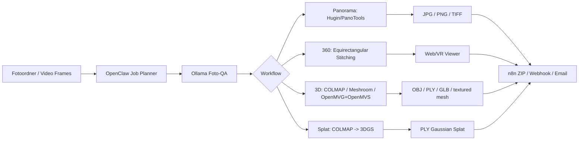

# FotoScan Panorama 360 3D

Das Profil `FotoScan_Panorama_360_3D` erweitert das Ultimate KI Setup um lokale Workflows fuer Panorama-Stitching, 360-Grad-Panoramen, einfache Photogrammetrie und optional Gaussian Splatting. Es ist lokal-first fuer Ubuntu/WSL2/Linux gedacht und integriert Ollama, OpenClaw, Codex und optional n8n.

## Ziel

- Mehrere Fotos automatisch zu Panoramen zusammenfuehren.
- Fotoserien zu sphaerischen/equirectangular 360-Grad-Panoramen vorbereiten.
- Fotos zu einfachen 3D-Modellen rekonstruieren.
- COLMAP-Daten als Vorstufe fuer Gaussian Splatting verwenden.
- OpenClaw soll Jobs mit Input/Output/Qualitaet/Workflow anlegen koennen.
- Ollama soll Fotoqualitaet bewerten, Aufnahmefehler erklaeren und bessere Aufnahmeplaene erzeugen.

## Architektur



## Workflow 1: Mehrere Fotos zu Panorama

Open-Source Tool: Hugin mit PanoTools.

Typischer CLI-Pfad:

```bash
cd ~/KI-Media/input/photos
pto_gen -o project.pto *.jpg
cpfind --multirow -o project.pto project.pto
autooptimiser -a -l -s -m -o project.pto project.pto
hugin_executor --stitching --prefix=~/KI-Media/output/panorama/pano project.pto
```

Ausgaben:

- JPG
- PNG
- TIFF

Optional:

- Sortieren nach EXIF-Zeitstempel.
- Entfernen verwackelter Bilder.
- Gruppieren nach Brennweite/Kamera.

## Workflow 2: Fotoserie zu 360-Grad-Panorama

Ziel ist ein sphaerisches/equirectangular Panorama fuer Webviewer, VR-Viewer oder 360-Grad-Viewer.

Moegliche Viewer:

- Marzipano
- Photo Sphere Viewer
- Three.js

Hinweis: Hugin kann 360-Grad-Panoramen erzeugen, aber die Qualitaet haengt stark von sauberer Ueberlappung, stabiler Kamera und passender Projektion ab.

## Workflow 3: Fotos zu 3D-Modell / Photogrammetrie

Tools:

- Meshroom / AliceVision: komfortable Pipeline, optional GPU-lastig, CLI ueber `meshroom_batch` bzw. `meshroom_compute` je nach Installation.
- COLMAP: robuste Structure-from-Motion- und MVS-CLI, gut fuer Automatisierung und auch als Vorstufe fuer Gaussian Splatting.
- OpenMVG + OpenMVS: klassischer Open-Source-Pfad fuer SfM plus Dense Reconstruction, eher Build-/Toolchain-intensiv.

Ausgabeformate:

- OBJ
- PLY
- GLB / glTF nach Konvertierung, z.B. ueber Blender
- textured mesh

Beispiel COLMAP:

```bash
PROJECT=~/KI-Media/output/3d/colmap_project
mkdir -p "$PROJECT/database" "$PROJECT/sparse" "$PROJECT/dense"
colmap automatic_reconstructor \
  --workspace_path "$PROJECT" \
  --image_path ~/KI-Media/input/photos \
  --quality medium \
  --data_type individual
```

Export/Weiterverarbeitung:

```bash
colmap model_converter \
  --input_path "$PROJECT/sparse/0" \
  --output_path "$PROJECT/model.ply" \
  --output_type PLY
```

GLB/OBJ-Konvertierung sollte realistisch ueber Blender, MeshLab oder eigene Pipeline erfolgen. Nicht jedes Tool erzeugt direkt ein sauberes GLB.

## Workflow 4: Fotos/Videos zu Gaussian Splatting optional

Gaussian Splatting ist optional, experimentell und GPU-lastig.

Typischer Pfad:

1. Video in Frames extrahieren oder Fotos sortieren.
2. COLMAP fuer Kameraposen und Sparse Point Cloud ausfuehren.
3. 3DGS-Training mit LichtFeld Studio, OpenSplat oder einer kompatiblen Pipeline.
4. Export als PLY oder SPLAT, je nach Tool.

Hinweise:

- NVIDIA CUDA ist klar bevorzugt.
- Viel VRAM und schneller SSD-Speicher helfen deutlich.
- CPU-only ist hoechstens fuer Tests sinnvoll.
- PLY-Ausgabe ist nicht automatisch ein klassisches Mesh; es ist eine Gaussian-Splat-Repräsentation.

## OpenClaw Job Schema

```yaml
workflow: panorama   # panorama | 360 | 3d | splat
input_folder: ~/KI-Media/input/photos
output_folder: ~/KI-Media/output/panorama
quality: medium      # low | medium | high | ultra
sort_exif: true
zip_result: true
notify: email
```

## Ollama Aufgaben

- Fotoqualitaet bewerten: Schaerfe, Belichtung, Ueberlappung, EXIF-Konsistenz.
- Fehlende Blickwinkel erkennen.
- Aufnahme-Anleitung fuer Panorama/360/3D generieren.
- Fehlerlogs von Hugin/COLMAP/Meshroom erklaeren.
- Qualitaets-Preset vorschlagen.

Geeignete Modelle:

- `qwen2.5-coder` oder `deepseek-coder` fuer CLI-/Script-Erklaerungen.
- `llama3.2` oder `mistral` fuer Aufnahmeplaene und Dokumentation.
- Vision-faehige Modelle optional, falls lokal vorhanden.

## n8n Automation

- Upload-Ordner ueberwachen.
- Job automatisch starten.
- Ergebnis als ZIP bereitstellen.
- Status per Webhook, Telegram oder Email melden.
- Fehlerbericht aus Logdateien erzeugen.

## Beispiel-Kommandos

Panorama aus Ordner:

```bash
bash scripts/install_fotoscan_panorama_360_3d.sh
cd ~/KI-Media/input/photos
pto_gen -o project.pto *.jpg
cpfind --multirow -o project.pto project.pto
autooptimiser -a -l -s -m -o project.pto project.pto
hugin_executor --stitching --prefix=~/KI-Media/output/panorama/pano project.pto
```

360-Grad-Panorama vorbereiten:

```bash
mkdir -p ~/KI-Media/output/360/viewer
cp ~/KI-Media/output/panorama/pano.tif ~/KI-Media/output/360/equirectangular.tif
```

COLMAP-Projekt starten:

```bash
PROJECT=~/KI-Media/output/3d/colmap_project
mkdir -p "$PROJECT"
colmap automatic_reconstructor --workspace_path "$PROJECT" --image_path ~/KI-Media/input/photos --quality medium
```

PLY exportieren:

```bash
colmap model_converter --input_path "$PROJECT/sparse/0" --output_path "$PROJECT/model.ply" --output_type PLY
```

ZIP-Ergebnis:

```bash
cd ~/KI-Media/output
zip -r fotoscan_result.zip panorama 360 3d splat
```

## Qualitaets- und Sicherheitsregeln

- Fotos brauchen etwa 60-80 Prozent Ueberlappung.
- Gute, gleichmaessige Beleuchtung.
- Keine stark spiegelnden oder transparenten Flaechen, wenn Photogrammetrie geplant ist.
- Moeglichst scharfe Bilder, keine Verwacklung.
- Gleiche Brennweite und keine wechselnden Zoomstufen.
- Fuer 3D: Objekt einmal komplett umrunden, auch leicht von oben/unten.
- Fuer Raeume: mehrere Blickwinkel und Hoehen verwenden.
- Keine privaten Innenraeume, Gesichter, Kennzeichen oder Sicherheitsdetails ohne Einwilligung verarbeiten.

## Grenzen

- Hugin ist stark fuer Panorama/360, aber kein 3D-Rekonstruktionstool.
- COLMAP rekonstruiert nicht aus jeder Fotoserie ein fertiges Mesh.
- Meshroom/AliceVision kann je nach GPU, Treiber und Binary-Verfuegbarkeit schwierig sein.
- Gaussian Splatting ist kein klassischer OBJ/GLB-Mesh-Export und braucht meist starke CUDA-GPU.

