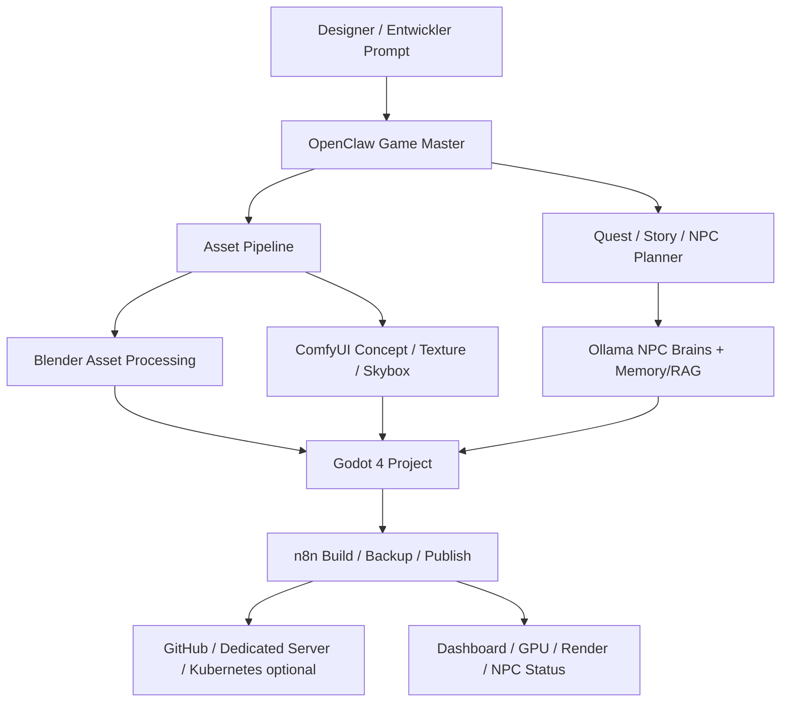

# GameDev 3D Studio NEXTLEVEL

Dieses Profil erweitert das Ultimate KI Setup zu einem lokalen AI Game Studio fuer Godot 4.x, Blender, ComfyUI, Ollama, OpenClaw, n8n, Voice, Renderfarm und spaetere Multiplayer-/Kubernetes-Workflows.

Ziel ist kein schweres Alles-auf-einmal-Setup, sondern ein modularer, speicherschonender Studio-Baukasten. Grosse Repositories, Demo-Projekte, Godot-Source-Builds, Modelle und Assets werden nur nach bewusster Aktivierung geladen.

## Einsatzgebiete

- Godot 4.x Projekte mit GDScript, C#, Vulkan, OpenXR, Multiplayer APIs und NavigationServer3D.
- Godot Demo Projects als lokale Lern-, Benchmark- und Testbibliothek.
- Blender Pipeline fuer Mesh Cleanup, PBR-Materialien, LODs, Asset-Konvertierung und Batch-Export.
- ComfyUI Workflows fuer Concept Art, Texturen, Skyboxes, NPC-Portraits, Item-Icons und Upscaling.
- Ollama NPC-System mit lokalen Dialogmodellen, Memory, RAG und Fraktionslogik.
- OpenClaw als Game Master, Quest Manager, AI Director, Story Generator und Welt-Synchronisierung.
- n8n Automatisierung fuer Builds, GitHub Uploads, Asset-Verwaltung, Discord, Backups und Render Queues.
- Multiplayer-Vorbereitung mit Linux Dedicated Server, Tailscale, Cloudflare Tunnel und spaeter Kubernetes.

## Architektur



## GitHub Projekte

| Bereich | Quelle | Nutzung |
|---|---|---|
| Godot Engine | `https://github.com/godotengine/godot` | Godot 4.x, Vulkan, GDScript, C#, OpenXR, Multiplayer, Navigation, AnimationTree |
| Godot Demo Projects | `https://github.com/godotengine/godot-demo-projects` | Demos, Benchmarks, Shader, Physics, 3D, Multiplayer |

## Lokale Projektstruktur

Das Installationsprofil legt unter `~/Ultimate_KI_Setup/gamedev_3d_studio` eine vorbereitete Struktur an:

```text
projects/godot/
projects/unreal/
projects/unity/
projects/npc-ai/
projects/worldgen/
projects/renderfarm/
projects/multiplayer/
projects/voice/
projects/mods/
ai/ollama/
ai/agents/
ai/memory/
ai/rag/
ai/npc-brains/
assets/textures/
assets/models/
assets/audio/
assets/music/
assets/skyboxes/
dashboard/gamedev-control-center/
benchmarks/
builds/
logs/
```

## Godot Pipeline

- Standard: nur Ordner und Hinweise anlegen.
- Optional: Godot Repository klonen mit `GAMEDEV_CLONE_GODOT=1`.
- Optional: Godot Demo Projects klonen mit `GAMEDEV_CLONE_DEMOS=1`.
- Optional: Godot bauen mit `GAMEDEV_BUILD_GODOT=1`.
- Empfehlung: Erst Godot Release-Binary nutzen, Source-Build nur bei genug Speicher und Zeit.

## Blender Pipeline

Blender wird als Asset-Werkbank vorgesehen fuer Import, Cleanup, Retopology, UV, Texture Baking, LODs, FBX/GLB/OBJ/STL Export und Headless Rendering. Die Installation von Blender wird nicht erzwungen; sie kann ueber Tool-Auswahl oder `GAMEDEV_INSTALL_HEAVY_TOOLS=1` erfolgen.

## ComfyUI GameDev Workflows

ComfyUI soll spaeter Workflows fuer Texturen, Skyboxes, NPC-Portraits, Item Icons, Concept Art, Terrain-Texturen, Upscaling und Batch-Rendering aufnehmen. Modelle werden nicht automatisch heruntergeladen.

## Ollama NPC System

Empfohlene lokale Modellrollen:

- kleines Modell fuer schnelle NPC-Dialoge: `llama3.2:1b`, `qwen2.5:3b`, `phi3`.
- staerkeres Modell fuer Story/Quest: Qwen, Llama, Mistral oder DeepSeek in passender Groesse.
- RAG/Memory mit Qdrant oder ChromaDB fuer Weltwissen, Beziehungen, Queststatus und Fraktionshistorie.

NPCs duerfen Spielzustand vorschlagen und simulieren. Persistente Memory-Schreibzugriffe sollten versioniert, begrenzt und exportierbar bleiben.

## OpenClaw als Game Master

OpenClaw kann Rollen uebernehmen:

- Quest Manager
- Story Generator
- AI Director
- NPC Controller
- Welt-Synchronisierung
- dynamischer Schwierigkeitsgrad
- Event-System

Live-Spielsteuerung sollte erst nach Sandbox-Tests und klaren Grenzen erfolgen.

## n8n Automatisierung

Sinnvolle Workflows:

- GitHub Push -> Testbuild -> Artefakt sichern.
- Neuer Asset-Ordner -> Thumbnail/Preview -> Asset-Katalog.
- Renderjob -> Queue -> Statusmeldung.
- Discord Webhook fuer Build- und Serverstatus.
- Backup von Projekten, Saves, NPC-Memory und Weltzustand.

## Multiplayer, Server und Kubernetes

Kubernetes bleibt optional. Geeignete spaetere Rollen:

- Node 1: Ollama / RAG / Agenten
- Node 2: Godot Dedicated Server
- Node 3: Render-/ComfyUI-GPU
- Node 4: Blender Batch Rendering
- Node 5: Monitoring und Dashboard

Bare-metal und WSL2 bleiben bevorzugt. Docker ist nur als optionaler Hinweis gedacht.

## Voice und Audio

Vorbereitete Bausteine:

- Whisper oder faster-whisper fuer Spracheingabe.
- Piper oder Coqui TTS fuer lokale Stimmen.
- XTTS/Emotion-Voice optional, nur mit sauberer Lizenz- und Einwilligungspruefung.
- FFmpeg fuer Schnitt, Normalisierung und Export.

## Modding und Open World

Das Profil dokumentiert spaetere Pfade fuer Minecraft KI-NPCs, VRChat, GTA-/Cyberpunk-Mods, Open-World-Systeme, Fraktionen, Wirtschaft, Wetter, Verkehr, AI Police, AI Dungeon Master und AI Companion Systeme. Diese Funktionen sind Entwicklungsziele, keine sofort fertigen Automatiken.

## Dashboard

Das geplante Dashboard soll GPU, Render Queue, NPC Status, Multiplayer Status, Kubernetes Nodes, Ollama Modelle, Speicherverbrauch und FPS Benchmarks anzeigen. Umsetzung kann spaeter mit React, Tailwind, WebGL/Three.js und einer lokalen API erfolgen.

## Erster Test

```bash
bash scripts/tools/gamedev_3d_studio_install.sh
ls ~/Ultimate_KI_Setup/gamedev_3d_studio
GAMEDEV_CLONE_DEMOS=1 bash scripts/tools/gamedev_3d_studio_install.sh
```

## Sicherheits- und Speicherregeln

- Keine API-Keys im Repo speichern.
- Keine grossen Modelle automatisch herunterladen.
- Godot-Source-Builds nur bei ausreichend Speicher.
- Demo- und Asset-Bibliotheken koennen schnell mehrere GB belegen.
- Multiplayer- und Cloudflare-Freigaben nur mit Auth, Firewall und bewusstem Zielmapping.
- NPC-Memory kann personenbezogene oder kreative Projektinhalte enthalten und gehoert in den Benutzer-Workspace.
