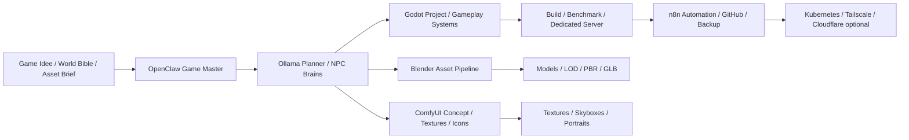

# GameDev 3D Studio NEXTLEVEL

Das Profil `GameDev_3D_Studio_NEXTLEVEL` erweitert das Ultimate KI Setup zu einem lokalen AI Game Studio fuer Godot, Blender, ComfyUI, Ollama-NPCs, OpenClaw als Game Master, n8n-Automation, Multiplayer-Server, Renderfarm, Voice-Systeme und spaetere Kubernetes-Skalierung. Es ist Linux-first, WSL2-kompatibel, offlinefreundlich und bevorzugt Open Source.

## Zielbild



## Kernziele

- Lokale Spielentwicklung mit Godot 4.x, GDScript, C#-Option, Vulkan, OpenXR und Multiplayer APIs.
- Lokale Demo-Bibliothek mit Godot Demo Projects fuer Shader, Physics, Multiplayer, 3D und Benchmarks.
- Blender-Pipeline fuer Modelle, PBR-Materialien, LOD, Asset-Konvertierung und GLB/FBX/OBJ/STL-Export.
- ComfyUI-Pipelines fuer Concept Art, Texturen, Skyboxes, NPC-Portraits, Icons und Terrain-Material.
- Ollama-basierte NPC-Gehirne mit RAG, Langzeitgedaechtnis, Fraktionen, Beziehungen, Geruechten und Dialog.
- OpenClaw als Quest Manager, AI Director, Game Master, Story Generator und Welt-Synchronisierung.
- n8n fuer Builds, GitHub, Backups, Render Queue, Discord/Webhooks und Mod-Synchronisierung.
- Multiplayer- und Serverkonzepte fuer Linux Dedicated Server, Tailscale/Cloudflare und spaeter Kubernetes.

## GitHub-Projekte

| Bereich | Projekt | Quelle | Umgang im Setup |
| --- | --- | --- | --- |
| Game Engine | Godot Engine | `https://github.com/godotengine/godot` | Optional klonen; Source-Build nur bewusst starten |
| Demo-Bibliothek | Godot Demo Projects | `https://github.com/godotengine/godot-demo-projects` | Optional klonen; lokale Demo- und Benchmark-Bibliothek |
| Blender | Blender | Paket/Website/Git optional | Bevorzugt Paket oder vorhandene Installation |
| ComfyUI | ComfyUI | vorhandenes Setup | GameDev-Workflows und Asset-Pfade vorbereiten |

Hinweis: Godot aus Source zu bauen kann lange dauern und viel Speicher brauchen. Fuer erste Tests ist ein offizielles Godot-Binary oder Paket oft sinnvoller als ein kompletter Build.

## Projektstruktur

```text
~/Ultimate_KI_Setup/gamedev_3d_studio/
  projects/
    godot/
    unreal/
    unity/
    npc-ai/
    worldgen/
    renderfarm/
    multiplayer/
    voice/
    mods/
  ai/
    ollama/
    agents/
    memory/
    rag/
    npc-brains/
  assets/
    textures/
    models/
    audio/
    music/
    skyboxes/
    icons/
    portraits/
  blender/
  comfyui/
  dashboard/
    gamedev-control-center/
  benchmarks/
  builds/
  docs/
  logs/
```

## Godot 4.x Pipeline

- Vulkan Renderer, Forward+/Mobile/Compatibility Renderpfade dokumentieren.
- GDScript als Standard, C# optional fuer groessere Tooling-Projekte.
- OpenXR fuer VR/AR-Prototypen.
- Multiplayer APIs fuer lokale Dedicated-Server-Tests.
- NavigationServer3D, AnimationTree, AnimationPlayer und CharacterBody3D als Kernbausteine.
- Terrain-Systeme ueber Add-ons oder eigene Chunk-/Heightmap-Pipelines.
- Demo-Projekte als Lern-, Benchmark- und Regressionstest-Bibliothek.

## Blender Pipeline

- Auto-Import von GLB/FBX/OBJ/STL in Projektordner.
- Asset-Konvertierung nach Godot-freundlichem GLB.
- PBR-Materialordner fuer Albedo, Normal, Roughness, Metallic, AO.
- LOD-Generator als geplanter Schritt; automatische LODs nur nach Sichtpruefung.
- Procedural Meshes fuer Prototyping, nicht fuer finale Collision ohne Review.
- Batch-Rendering fuer Icons, Thumbnails, Cutscenes und Marketing-Screenshots.

## ComfyUI GameDev Workflows

- Texture Generation fuer Terrain, Props, UI und Decals.
- Concept Art fuer Figuren, Waffen, Gebaeude, Fahrzeuge und Fraktionen.
- Skybox Generation und Panorama-Varianten.
- NPC Portrait Generator fuer Dialogsysteme.
- AI Item Icons fuer Inventar und Shops.
- Batch Upscaler und Stil-Konsistenz ueber Referenzbilder/LoRAs.

Grosse Modelle, LoRAs und kommerzielle APIs werden nicht automatisch geladen. Lizenz, Stilrechte und Model Cards muessen bewusst geprueft werden.

## Ollama NPC System

NPCs koennen lokal mit Ollama, RAG und Vektor-Datenbanken vorbereitet werden:

- NPC-Gehirne mit Persona, Zielen, Wissen und Grenzen.
- Haendler-KI mit Angebot, Nachfrage, Preisen und Erinnerungen.
- Fraktions-KI mit Beziehungen, Geruechten und Konflikten.
- Quest-KI fuer dynamische Aufgaben und Dialogoptionen.
- Dungeon-Master-KI fuer Pen-and-Paper- und Roguelike-Systeme.
- Emotionale NPC-Systeme mit Stimmungen, Vertrauen und Beziehungshistorie.

Datenschutzregel: Spielerdaten, Voice-Transkripte und Langzeit-Memory bleiben lokal, ausser Cloud-Export wird explizit aktiviert.

## OpenClaw als Game Master

OpenClaw kann als Orchestrator arbeiten:

- Quest Manager und Story Generator.
- NPC Controller und Dialogplaner.
- AI Director fuer Spannung, Schwierigkeit, Spawn- und Event-Dichte.
- Welt-Synchronisierung zwischen Godot, n8n, RAG und Savegame.
- Live-Event-Systeme fuer Missionen, Wetter, Fraktionen und Wirtschaft.
- automatische Dialoge und dynamische Weltveraenderungen.

OpenClaw sollte keine unkontrollierten Live-Server-Aktionen ohne Freigabe ausfuehren. Deployments, Mod-Uploads und Multiplayer-Changes brauchen Review.

## n8n Automation

- Godot Builds fuer Linux/Windows/Web vorbereiten.
- GitHub Pull Requests und Release-Artefakte erzeugen.
- Asset-Import, Konvertierung und Report automatisieren.
- Discord/Webhook-Meldungen fuer Builds, Renderjobs und Serverstatus.
- Render Queue und Backup-Systeme steuern.
- Multiplayer-Deployments vorbereiten, aber nicht blind live schalten.
- Mod-Synchronisierung und Konfliktberichte erstellen.

## Multiplayer und Kubernetes

Optionales Skalierungsmodell:

- Node 1: Ollama, OpenClaw, n8n, RAG.
- Node 2: Godot Dedicated Server / Matchmaking.
- Node 3: Blender/ComfyUI Render Worker.
- Node 4: Voice/NPC/Simulation Worker.
- Node 5+: GPU Nodes fuer Renderfarm, Video, Cutscenes.

Unterstuetzt werden Linux Dedicated Server, bare-metal bevorzugt, Docker optional, Tailscale/Cloudflare fuer sicheren Zugriff und spaetere Kubernetes-Autoskalierung.

## Renderfarm

- Multi-GPU Rendering und Blender Batch-Rendering.
- Cinematic Cutscenes und AI-Video-Pipelines.
- GPU-Auslastung, Job-Prioritaeten und Warteschlangen.
- Rendercache, Asset-Versionen und Output-Archiv.
- Keine Cloud-Renderkosten ohne explizite API-Keys und Kostenlimit.

## Voice und Audio

- Whisper/Faster-Whisper fuer Speech-to-Text.
- Piper, Coqui TTS und XTTS-nahe Workflows fuer NPC-Stimmen.
- AI-Erzaehler, Radio-Systeme, regionale Akzente und emotionale Stimmen.
- Musik- und Soundeffekt-Pipelines ueber vorhandene Audio-/Media-Profile.

Stimmrechte und Einwilligungen beachten. Keine echten Stimmen ohne Rechte klonen.

## Cyberpunk / Open World Modus

Dieses Profil bereitet Konzepte fuer groessere Welten vor:

- prozedurale Staedte, Distrikte, Verkehr und Tagesablaeufe.
- Fraktionen, Wirtschaft, Rufsystem und dynamische Geruechte.
- AI Polizei/Kriminalitaet als Simulationssystem.
- Wetter-KI, Ereignisse und Weltveraenderungen.
- NPC-Tagesplaene und lokale Memory-Shards.

## Modding Support

Vorbereitet als Dokumentations- und Tooling-Schicht:

- Cyberpunk 2077 Mods, GTA Mods, Minecraft KI-NPCs, VRChat und Open-Metaverse-Ideen.
- Mod Loader, Mod SDK und Mod API als spaetere Projektmodule.
- automatische Mod-Konfliktpruefung ueber Dateilisten, Manifest und Checksums.

Rechtlicher Hinweis: Modding muss EULAs, Lizenzen, Nutzungsbedingungen und Plattformregeln beachten.

## AI Game Studio Dashboard

Das geplante `gamedev-control-center` zeigt:

- GPU Status und VRAM.
- Render Status und Queue.
- NPC Status, Memory und Fraktionen.
- Multiplayer Server und Kubernetes Nodes.
- Ollama Modelle und Token-/Latenzwerte.
- Speicherverbrauch, Buildstatus, FPS Benchmarks.
- Dark Mode, mobilfaehige WebUI und lokale Auth.

## Erste Tests

```bash
bash scripts/tools/gamedev_3d_studio_install.sh
cd ~/Ultimate_KI_Setup/gamedev_3d_studio
git -C projects/godot/godot status || true
git -C projects/godot/godot-demo-projects status || true
```

Wenn wenig Speicherplatz vorhanden ist, zuerst mit `GAMEDEV_CLONE_GODOT=0 GAMEDEV_CLONE_DEMOS=0` nur die Struktur anlegen.
