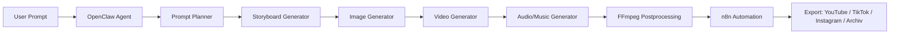

# OpenHiggsStack AI Cinema Studio

Status: `experimental`  
Tier: `advanced`  
Kategorie: `media`

OpenHiggsStack ist ein optionales lokales bzw. halb-lokales AI-Cinema- und Marketing-Studio. Es ist kein 1:1-Klon von Higgsfield AI, sondern eine modulare Self-Hosted-Pipeline aus OpenClaw, Ollama, ComfyUI, Wan2.x, FFmpeg, n8n und optionalen Cloud-APIs.

## Zweck

Higgsfield AI bietet cloudbasierte Bild-/Video-/Marketing-Funktionen und eine CLI-/MCP-Anbindung fuer Agenten. OpenHiggsStack bildet die offenen Bausteine nach, soweit sie lokal oder self-hosted sinnvoll nutzbar sind.

Ziel:

- Text-to-Video und Image-to-Video lokal vorbereiten.
- Storyboards, Prompts, Shots und Kamerabewegungen mit Ollama/OpenClaw planen.
- ComfyUI als visuelle Workflow-Engine nutzen.
- Wan2.1/Wan2.2 als lokale Video-Modellfamilie einbinden.
- FFmpeg fuer Postprocessing, Schnitt, Audio, Untertitel und Export verwenden.
- n8n fuer Automationen, Warteschlangen und Publishing-Vorbereitung nutzen.
- Cloud-Modelle nur optional und bewusst aktivieren.

## Einsatzgebiete

- Text-to-Video
- Image-to-Video
- AI Influencer und virtuelle Creator
- Marketing Clips
- Musikvideo-Pipeline
- Social-Media-Shorts
- Produktvideos
- Character Consistency
- Kamera-/Motion-Presets
- Virality-/Marketing-Analyse
- Thumbnail- und Hook-Varianten
- Batch-Rendering mit Warteschlange

## Zusammenspiel der Komponenten

| Komponente | Rolle |
|---|---|
| Ollama | lokale Planung, Prompt-Varianten, Shotlisten, Stilregeln |
| OpenClaw | Agenten-Orchestrierung, Toolaufrufe, Freigaben, Memory |
| n8n | Workflow-Automation, Warteschlange, Export-Vorbereitung |
| ComfyUI | Node-basierte Bild-/Video-/Audio-/3D-Workflow-Engine |
| Wan2.1/Wan2.2 | lokale Text-to-Video- und Image-to-Video-Modellfamilie |
| Open Generative AI | offene Web-Studio-Inspiration fuer Higgsfield-aehnliche Workflows |
| FFmpeg | Schnitt, Transcoding, Audio-Muxing, Untertitel, Thumbnails |
| Higgsfield CLI/API optional | Cloud-Fallback oder Vergleichspfad, nur mit eigenen Keys |
| Veo/Kling/Seedance/Sora/Runway/Pika optional | externe Modelle, kosten- und datenschutzpflichtig |

## Architektur



## Lokale Betriebsmodi

### Prompt-only

- geeignet fuer Low-End-CPU, VPS ohne GPU oder WSL2 ohne NVIDIA-Pfad
- erzeugt Storyboards, Shotlisten, Promptpakete und n8n-Aufgaben
- kein lokales Rendering grosser Modelle

### Local GPU

- ComfyUI lokal
- Wan2.x-Workflows manuell installiert
- FFmpeg lokal
- ideal fuer MiniPC/GPU-Workstation mit ausreichend VRAM und SSD

### Hybrid

- lokale Planung und Asset-Verwaltung
- optional Cloud-APIs fuer einzelne Renderjobs
- Kostenlimits und Datenschutzregeln zwingend dokumentieren

### K3s/Advanced

- Rendering-Worker spaeter ueber Kubernetes/Queue trennbar
- noch nicht als Standard-Setup umgesetzt
- nur sinnvoll mit GPU-Nodes, Storage-Konzept und Monitoring

## Sicherheit, Rechte und Kostenkontrolle

- Keine API-Keys in Git speichern.
- Cloud-Modelle nur mit bewusst gesetzten Keys aktivieren.
- Keine Deepfakes realer Personen ohne Zustimmung.
- Keine heimliche Gesichtserkennung oder biometrische Identifikation.
- Marken, Musikrechte, Stockmaterial und Personenrechte pruefen.
- Kostenlimits fuer externe APIs definieren.
- Lokale Outputs koennen gross werden; Speicher regelmaessig pruefen.
- NSFW-/Jugendschutz-Filter fuer public-facing Creator-Workflows einplanen.

## Empfohlene Ordnerstruktur

```text
~/ai-stack/
  comfyui/
  models/
    image/
    video/
    vae/
    loras/
  outputs/
    video/
    image/
    audio/
  workflows/
    comfyui/
    n8n/
  prompts/
  logs/
~/.openclaw/agents/video-director/
```

## Beispiel `.env`

Siehe [../../.env.openhiggsstack.example](../../.env.openhiggsstack.example).

## Agentenprofile

- [Video Director Agent](../agents/video-director-agent.md)
- [Storyboard Agent](../agents/storyboard-agent.md)
- [Social Media Clip Agent](../agents/social-media-clip-agent.md)
- [Music Video Agent](../agents/music-video-agent.md)

## n8n Workflow-Ideen

Siehe [OpenHiggsStack Workflows](../n8n/openhiggsstack-workflows.md).

## Quickstart

```bash
bash scripts/install-openhiggsstack.sh
cp .env.openhiggsstack.example ~/.openclaw_ultimate_user_data/openhiggsstack/.env
```

Danach manuell:

1. ComfyUI starten.
2. Wan2.x-Modelle gemaess eigener Hardware passend herunterladen.
3. ComfyUI-Wan-Workflow importieren.
4. Ollama-Modell bereitstellen, z. B. `ollama pull llama3.2:1b`.
5. Einen Agentenprompt aus `docs/agents/` testen.

## Grenzen

OpenHiggsStack ist eine Arbeitsgrundlage. Es ersetzt nicht automatisch eine fertige Higgsfield-Cloud-Produktion. Besonders Character Consistency, Multi-Shot-Kontinuitaet, Lippenbewegung, saubere Haende/Gesichter und lange Videos bleiben anspruchsvoll und brauchen manuelle Kontrolle.

## Gepruefte Quellen und Referenzen

- Higgsfield CLI: `https://github.com/higgsfield-ai/cli`
- Higgsfield Skills: `https://github.com/higgsfield-ai/skills`
- Open Generative AI: `https://github.com/anil-matcha/open-generative-ai`
- Open Higgsfield AI Doku: `https://anil-matcha-open-higgsfield-ai.mintlify.app/`
- ComfyUI: `https://github.com/comfy-org/ComfyUI`
- Wan2.1: `https://github.com/Wan-Video/Wan2.1`
- Wan2.2: `https://github.com/Wan-Video/Wan2.2`
- ComfyUI Wan2.2 Tutorial: `https://docs.comfy.org/tutorials/video/wan/wan2_2`
