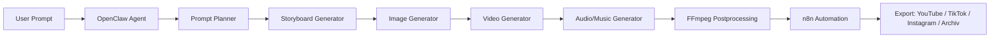

# OpenHiggsStack AI Cinema Studio

Status: experimental  
Kategorie: Media / Video / Marketing / Agenten  
Zielsystem: MiniPC/GPU-Workstation, optional WSL2, optional VPS-Orchestrierung  

## Zweck

OpenHiggsStack ist ein optionales lokales oder halb-lokales AI-Cinema-Studio fuer das Ultimate-KI-Setup. Es ist keine 1:1-Kopie von Higgsfield AI, sondern eine modulare Self-Hosted-Pipeline fuer Bild-, Video-, Musikvideo-, Marketing- und Social-Media-Produktion mit OpenClaw, Ollama, ComfyUI, Wan2.x, FFmpeg und n8n.

Higgsfield AI bleibt als proprietaere Cloud-/API-Option dokumentiert. Lokale Workflows sollen jedoch bevorzugt werden, wenn Datenschutz, Kostenkontrolle, Offline-Faehigkeit oder kreative Kontrolle wichtiger sind.

## Quellen und Einordnung

- [Higgsfield CLI](https://github.com/higgsfield-ai/cli): CLI fuer Bild-/Video-Generierung, Marketing Studio, Virality Predictor, Soul/Character-Funktionen und Cloud-Modelle.
- [Higgsfield Skills](https://github.com/higgsfield-ai/skills): Agenten-/Skill-Integrationen als Inspiration fuer Codex, Claude Code, OpenClaw und MCP-nahe Workflows.
- [Open Generative AI](https://github.com/anil-matcha/open-generative-ai): Open-Source-orientiertes Studio fuer viele Bild-/Video-Modelle und self-hosted Anwendungslogik.
- [Open Higgsfield AI Docs](https://anil-matcha-open-higgsfield-ai.mintlify.app/): Dokumentation zur offenen Higgsfield-inspirierten Plattform.
- [ComfyUI](https://github.com/comfy-org/ComfyUI): modulare Node-/Graph-Engine fuer Diffusion, Bild, Video, Audio und API-Workflows.
- [Wan2.1](https://github.com/Wan-Video/Wan2.1): offene Video-Modelle fuer Text-to-Video, Image-to-Video, Editing und Video-to-Audio; kleine Workflows koennen bereits mit Consumer-GPUs starten.
- [Wan2.2](https://github.com/Wan-Video/Wan2.2): neuere Wan-Generation fuer offene Large-Scale-Video-Workflows.
- [ComfyUI Wan2.2 Workflow](https://docs.comfy.org/tutorials/video/wan/wan2_2): offizielles ComfyUI-Beispiel fuer Wan2.2-Workflows.

## Einsatzgebiete

- Text-to-Video aus Skript, Kampagnenidee oder Storyboard.
- Image-to-Video aus Produktfoto, Charakterbild, Raumfoto oder Thumbnail.
- AI-Influencer- und Creator-Workflows mit konsistenten Charakteren.
- Marketing-Clips fuer Produkte, Landingpages, Ads und Reels.
- Musikvideo-Pipeline aus Songidee, Suno/Udio-Track, Lyrics und Moodboard.
- Social-Media-Shorts fuer TikTok, YouTube Shorts, Instagram Reels und Archivclips.
- Produktvideos mit kontrolliertem Stil, Licht, Kamera und Schnittlogik.
- Character Consistency mit Referenzbildern, LoRA-/IPAdapter-/ControlNet-nahen Konzepten.
- Kamera- und Motion-Presets wie Dolly, Push-in, Orbit, Handheld, Drone Shot, Macro.
- Virality-/Marketing-Analyse als optionaler Cloud- oder lokaler Heuristik-Schritt.

## Zusammenspiel im Setup

- Ollama erzeugt Briefings, Prompts, Shotlisten, negative Prompts und Varianten.
- OpenClaw koordiniert Agentenrollen wie Video Director, Storyboard, Social Clip und Music Video.
- n8n automatisiert Warteschlangen, Statusmeldungen, Exporte und Publishing-Vorbereitung.
- ComfyUI fuehrt Bild- und Video-Workflows lokal oder auf einer GPU-Workstation aus.
- Wan2.1/Wan2.2 liefern offene Video-Generierungsmodelle fuer lokale Pipeline-Experimente.
- Open Generative AI kann als Web-UI-/Produkt-Inspiration fuer ein eigenes Studio dienen.
- FFmpeg uebernimmt Schnitt, Transcoding, Untertitel, Seitenverhaeltnisse und Audio-Muxing.
- Higgsfield CLI/API bleibt optionaler Cloud-Fallback fuer Modelle, Marketing Studio, Soul ID oder Virality Predictor.
- Cloud-Modelle wie Veo, Kling, Seedance, Sora 2, Runway und Pika duerfen nur bewusst per API-Key aktiviert werden.
- Stable Diffusion lokal bleibt die bevorzugte Bildbasis fuer Datenschutz, Kostenkontrolle und reproduzierbare Workflows.

## Architektur



## Empfohlene Ordner

```text
~/ai-stack/
  comfyui/
  models/
    image/
    video/
    loras/
    controlnet/
  outputs/
    video/
    images/
    storyboards/
  projects/
    <projektname>/
      brief.md
      storyboard.md
      prompts/
      assets/
      renders/
      exports/
~/.openclaw/agents/video-director/
```

## Datenschutz und Kostenkontrolle

- Standard: lokal arbeiten, keine Cloud-API ohne bewusste Aktivierung.
- Keine API-Keys ins Repository schreiben.
- Personenbilder, Marken, Stimmen und Charaktere nur mit Rechten oder Zustimmung verwenden.
- Keine Deepfakes realer Personen ohne Einwilligung.
- Cloud-Kosten mit Tageslimit, Projektlimit und manueller Freigabe absichern.
- Groesse von Modell-Downloads vorher pruefen; Wan-/Video-Modelle koennen viele GB beanspruchen.

## Beispielprompt

```text
Erstelle ein Storyboard fuer einen 20-Sekunden-Produktclip im Format 9:16.
Produkt: tragbare Powerbank.
Stil: hochwertig, warmes Licht, realistische Kamera, kein Cartoon.
Ausgabe:
1. Hook in 2 Sekunden
2. 5 Shots mit Kameraanweisung
3. Bildprompt je Shot
4. Videoprompt je Shot
5. Negative Prompts
6. FFmpeg Exportziel fuer TikTok und YouTube Shorts
```

## Erste Tests

1. `bash scripts/install-openhiggsstack.sh`
2. Nur Ordnerstruktur und `.env` erzeugen lassen.
3. ComfyUI optional klonen, aber keine grossen Modelle automatisch laden.
4. ComfyUI separat starten und ein kleines Bild- oder Wan-Testworkflow manuell laden.
5. Mit `docs/agents/video-director-agent.md` einen ersten Shotplan erzeugen.

## Grenzen

- CPU-only ist nur fuer Planung, Prompting und sehr kleine Tests sinnvoll.
- 8-12 GB VRAM reichen nur fuer kleine/optimierte Workflows.
- 16-24 GB VRAM sind fuer lokale Video-KI deutlich realistischer.
- Multi-GPU/Kubernetes bleibt Advanced/Experimental.
- Dieses Profil installiert keine grossen Modelle automatisch.
## Hugging Face / Huge_Facing als Modellquelle

Hugging Face wird im OpenHiggsStack nicht als Pflicht-Cloud-Dienst verstanden, sondern als optionale Modellquelle, Lizenznachweis und Versionsanker. Viele lokale Bild-, Video-, Audio- und Multimodal-Workflows beziehen Modellkarten, Beispiel-Workflows oder Gewichte ueber Hugging Face. Im historischen Setup-Kontext kann dies auch als `Huge_Facing` gefuehrt werden.

Empfohlene Nutzung:

- Modellkarten, Lizenzbedingungen, Speicherbedarf und Hardwarehinweise vor dem Download pruefen.
- Grosse Modelle manuell herunterladen und nicht automatisch durch das Setup ziehen lassen.
- `HUGGINGFACE_TOKEN` nur lokal in `.env.openhiggsstack` oder unter `~/.openclaw_ultimate_user_data` speichern, niemals im Repo.
- Modellpfade in OpenClaw-, ComfyUI- und n8n-Workflows dokumentieren, damit spaeter nachvollziehbar bleibt, welches Modell welchen Clip erzeugt hat.
- Bei kommerzieller Nutzung Lizenz, Quellenangabe und erlaubte Ausgabeverwendung gesondert pruefen.

Typische Modellquellen:

- Wan2.x-Video-Modelle und Varianten
- Flux-, SDXL- und Stable-Diffusion-Bildmodelle
- LoRA-, ControlNet-, IPAdapter- und Upscaler-Modelle
- Whisper-, TTS- oder Multimodal-Modelle fuer optionale Audio-/Voice-Erweiterungen
