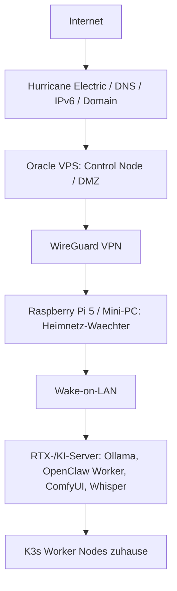

# Einsteiger-Tutorial: HE vorne, Oracle steuert, Pi weckt, RTX rechnet

Dieses Dokument ist der empfohlene Startpunkt fuer die neue sichere
Zielarchitektur des Ultimate KI Setup.

Der Merksatz lautet:

```text
HE vorne, Oracle steuert, Pi weckt, RTX rechnet.
```

## Warum diese Architektur?

Viele KI-Dienste sind stark und sensibel: Ollama, OpenClaw, ComfyUI, Whisper,
Home Assistant, Kubernetes und Datenbanken sollen nicht direkt im Internet
stehen. Stattdessen gibt es eine klare Kette:

1. Hurricane Electric / eigene Domain / IPv6 ist der externe Einstieg.
2. Oracle VPS ist die Online-Steuerzentrale und DMZ.
3. WireGuard verbindet den VPS sicher mit zuhause.
4. Raspberry Pi 5 oder Mini-PC zuhause bleibt immer an.
5. Der Heimnetz-Waechter weckt bei Bedarf den RTX-/KI-Server.
6. Der RTX-Server rechnet nur, wenn er gebraucht wird.

## Zielbild



## Was ist neu gegenueber frueher?

Cloudflare ist nicht mehr Pflichtbestandteil. Cloudflare bleibt eine gute
optionale Alternative fuer:

- Cloudflare Access
- Cloudflare Tunnel
- zusaetzlichen Bot- oder DDoS-Schutz
- Zero-Trust-Zugriff

Der Standardpfad ist aber:

- Hurricane Electric / eigene Domain / IPv6
- Oracle VPS
- WireGuard
- Reverse Proxy
- CrowdSec
- Fail2Ban
- Firewall
- K3s
- Heimnetz-Waechter

## Wichtig fuer Einsteiger

Wenn du dir nur eine Sache merkst:

> Veröffentliche niemals Ollama, OpenClaw, Home Assistant, Kubernetes API,
> NAS, Datenbanken, ComfyUI oder Whisper direkt ins Internet.

Diese Dienste gehoeren hinter WireGuard oder in ein internes Netz.

## Rollen einfach erklaert

### Hurricane Electric

Hurricane Electric ist vorne im Internet sichtbar. Dort liegt der Domain-,
DNS- und IPv6-Kontext. HE ist aber kein vollstaendiger DDoS-Schutz.

Bei Angriffen brauchst du zusaetzlich:

- VPS-Firewall
- Rate-Limits
- CrowdSec
- Fail2Ban
- Reverse Proxy Regeln
- Provider-Regeln
- bei groesseren Angriffen externes Scrubbing oder BGP-Mitigation

### Oracle VPS

Der Oracle VPS bleibt immer online und steuert:

- n8n
- Monitoring
- Uptime Kuma
- Reverse Proxy
- WireGuard Server
- GitHub Webhooks
- Wake-Orchestrator
- optional K3s Server / Control Plane

Der VPS darf sensible Heimdienste nicht direkt weiterleiten.

### Heimnetz-Waechter

Ein Raspberry Pi 5 oder Mini-PC zuhause bleibt immer eingeschaltet.

Er kann:

- WireGuard Peer zum Oracle VPS halten
- Wake-on-LAN Magic Packets senden
- lokale Nodes pruefen
- Home Assistant anbinden
- Healthchecks an den VPS melden
- optional als K3s Edge Node laufen

### RTX-/KI-Server

Der RTX-Server darf schlafen. Wenn ein Job kommt, wird er geweckt.

Ablauf:

1. Job kommt ueber OpenClaw, n8n, GitHub oder Webhook rein.
2. Oracle VPS erkennt: GPU, LLM oder Rendering wird benoetigt.
3. Oracle VPS sendet den Wake-Auftrag ueber WireGuard an den Heimnetz-Waechter.
4. Der Waechter sendet Wake-on-LAN an den RTX-Server.
5. RTX-Server startet Ollama, OpenClaw Worker, ComfyUI, Whisper oder K3s Worker.
6. Job wird ausgefuehrt.
7. Nach Idle-Zeit kann der Server optional wieder herunterfahren.

## Erster sicherer Aufbau

### Schritt 1: Nur den VPS ins Internet stellen

Erlaubt oeffentlich:

- `80/tcp` fuer HTTP Redirect / ACME
- `443/tcp` fuer HTTPS Reverse Proxy
- `51820/udp` fuer WireGuard
- `22/tcp` nur begrenzt oder besser nur per WireGuard

Nicht oeffentlich:

- Ollama `11434`
- OpenClaw Gateway
- Kubernetes API `6443`
- Home Assistant `8123`
- NAS
- Datenbanken
- ComfyUI `8188`
- Whisper APIs

### Schritt 2: WireGuard zuerst

Baue zuerst den VPN-Tunnel, bevor du Heimdienste anbinden willst.

```bash
bash scripts/wireguard/create-vps-peer.sh --dry-run
bash scripts/wireguard/create-home-peer.sh --dry-run
```

### Schritt 3: Firewall aktivieren

```bash
bash scripts/security/setup-ufw.sh --dry-run
```

Erst wenn die Regeln passen:

```bash
sudo bash scripts/security/setup-ufw.sh --apply
```

### Schritt 4: Heimnetz-Waechter vorbereiten

Auf dem Raspberry Pi 5 oder Mini-PC:

```bash
bash scripts/home-watcher/check-gpu-server.sh --dry-run
bash scripts/home-watcher/wake-gpu-server.sh --dry-run
```

### Schritt 5: Monitoring aktivieren

Mindestens pruefen:

- WireGuard Tunnel
- VPS erreichbar
- Heimnetz-Waechter erreichbar
- RTX-Server schlaeft oder ist online
- Ollama nur intern erreichbar
- OpenClaw nur intern erreichbar
- n8n nur abgesichert erreichbar

## Platzhalter

Alle Beispiele nutzen Platzhalter:

- `example.tld`
- `VPS_PUBLIC_IP`
- `HOME_WATCHER_IP`
- `GPU_SERVER_MAC`
- `GPU_SERVER_IP`
- `WG_PRIVATE_KEY_PLACEHOLDER`

Ersetze sie nur lokal, niemals im Repository.

## Weiterfuehrende Dokumente

- [DDoS und Hardening](../security/ddos-and-hardening.md)
- [WireGuard Topologie](../security/wireguard-topology.md)
- [Reverse Proxy Hardening](../security/reverse-proxy-hardening.md)
- [CrowdSec und Fail2Ban](../security/crowdsec-fail2ban.md)
- [K3s Homecluster](../kubernetes/k3s-homecluster.md)
- [RPi5 Wake Orchestrator](../home-watcher/rpi5-wake-orchestrator.md)
