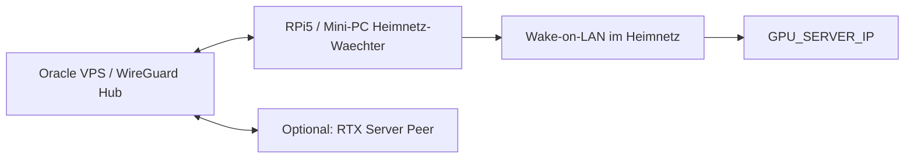

# WireGuard Topologie

WireGuard ist die sichere Hauptverbindung zwischen Oracle VPS und Heimnetz.

## Rollen



## Grundregeln

- VPS ist der WireGuard Hub.
- Heimnetz-Waechter ist dauerhafter Peer.
- RTX-Server kann optional eigener Peer sein.
- `AllowedIPs` eng halten.
- Keine sensiblen Dienste ohne VPN veroeffentlichen.

## Beispielwerte

```text
VPS_PUBLIC_IP
HOME_WATCHER_IP
GPU_SERVER_IP
WG_PRIVATE_KEY_PLACEHOLDER
```

## VPS Peer erzeugen

```bash
bash scripts/wireguard/create-vps-peer.sh --dry-run
sudo bash scripts/wireguard/create-vps-peer.sh --apply
```

## Home Peer erzeugen

```bash
bash scripts/wireguard/create-home-peer.sh --dry-run
sudo bash scripts/wireguard/create-home-peer.sh --apply
```

## Was nicht ueber das Internet erreichbar sein darf

- Ollama
- OpenClaw Gateway
- Kubernetes API
- Home Assistant
- NAS
- Datenbanken
- ComfyUI
- Whisper APIs
