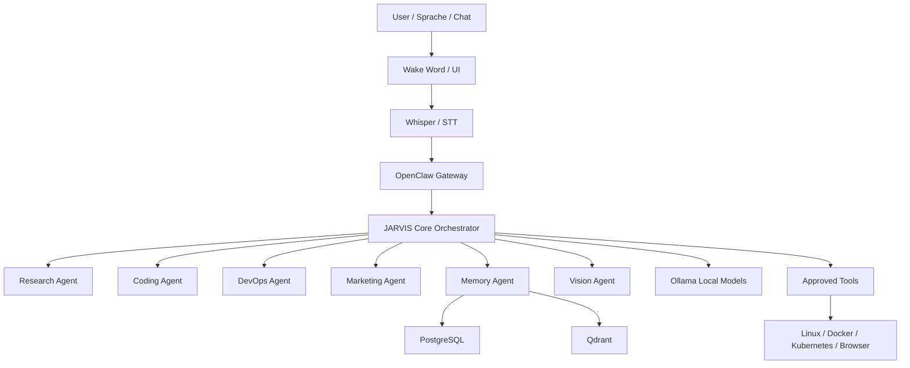

# Ultimate JARVIS Profile

Status: `planned` / `documentation-first`

## Ziel

Ultimate JARVIS ist ein Betriebsprofil fuer einen lokalen, modularen KI-Assistenten auf Basis von OpenClaw, Ollama, Memory/RAG, Voice und sicheren Tool-Freigaben.

Funktionen:

- Sprachsteuerung mit Wake Word, Whisper und Piper
- Multi-Agent-System ueber OpenClaw
- Langzeitgedaechtnis mit PostgreSQL und Qdrant
- Dokumentenanalyse und RAG
- Smart-Home-Steuerung mit klaren Freigaben
- Kubernetes-/Docker-Verwaltung nur autorisiert
- Coding-, Research-, DevOps-, Marketing- und Memory-Agenten
- Lokale LLMs als Standard ueber Ollama

## Sicherheitsstatus

Dieses Profil installiert nichts automatisch. Es ist ein Architektur- und Betriebsprofil. Kritische Aktionen wie Shell, Docker, Kubernetes, Smart Home, E-Mail, Dateizugriff oder Browser-Automation duerfen nur nach ausdruecklicher Freigabe ausgefuehrt werden.

## Architektur

## Empfohlener Start

1. Basis lokal installieren: Ollama, OpenClaw, Qdrant.
2. Voice nur lokal testen: Whisper und Piper.
3. Memory erst mit Testdaten aktivieren.
4. Tool-Freigaben schrittweise aktivieren.
5. Kubernetes und Smart Home erst nach Sicherheitsreview verbinden.

## Nicht automatisch aktivieren

- offene Admin-Ports
- autonome Shell-/Docker-/Kubernetes-Aktionen
- Smart-Home-Schaltbefehle ohne Bestaetigung
- Cloud-APIs ohne Kostenwarnung
- permanente Speicherung sensibler Inhalte ohne Policy
